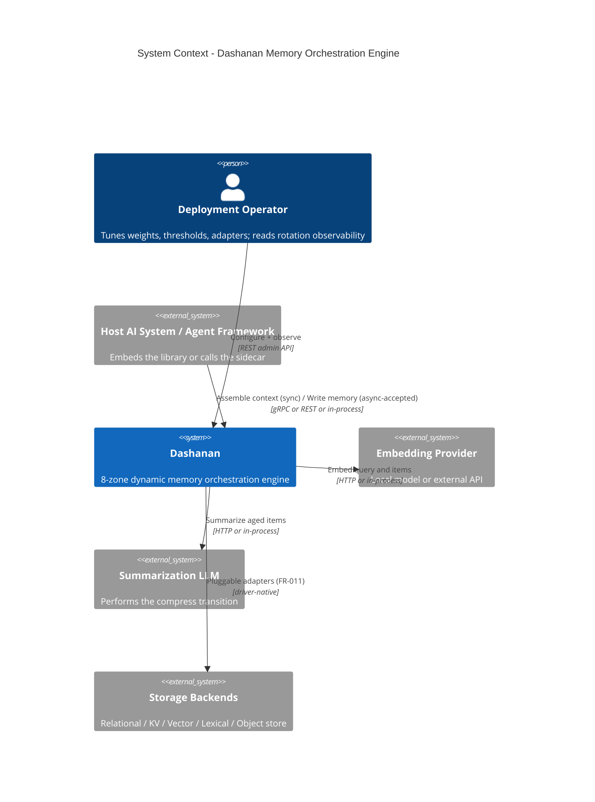
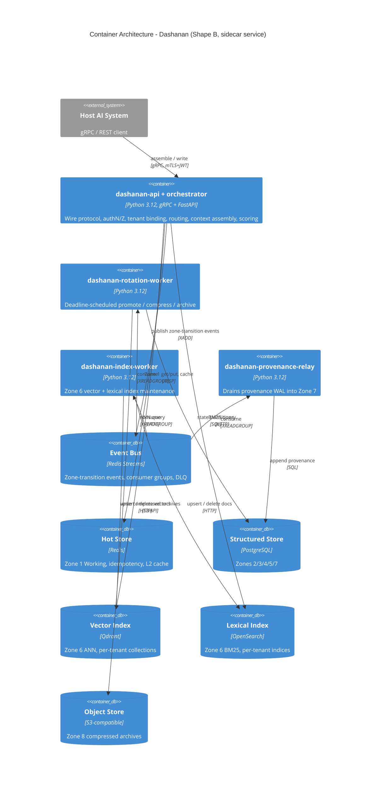

# High-Level Design (HLD) Document — Dashanan

<!-- Phase 1 Output | Solution Architecture Pipeline | Produced by: solution-architect (opus) -->
<!-- Consensus gate (consensus-agent) runs as a SEPARATE step after this document. -->

**Document ID:** HLD-20260917-01
**Version:** 1.0.0
**Status:** DRAFT — PENDING CONSENSUS GATE
**Created:** 2026-09-17
**Entry Mode:** Greenfield (Mode A) — verified: `Dashanan/` contained only `README.md` + `docs/` (no prior architecture artifacts, no source tree)
**Source PRD:** `docs/phase-0-output/PRD.md` (PRD-20260917-01 v1.0.0)
**Locked inputs:** `docs/orchestration/01-vision-and-prd.md` (8-zone taxonomy, Memory Score formula, rotation state machine, Zone 3/5 ownership ADR)
**Supporting inputs:** `docs/phase-0-output/research-brief.md`, `landscape-scan.md`, `product-strategy-and-prioritization.md`
**India Regulatory Applicable:** YES (DPDP Act 2023 — NFR-006; CERT-In log retention)
**Consensus Gate:** PENDING

---

## Section 0 — How to Read This Document

This HLD **does not redesign** the locked Phase 0 shape. The 8-zone taxonomy, the 6-term Memory Score formula, the `Active -> Compressed -> Archived` state machine, and the Zone 3 / Zone 5 ownership rule are treated as approved inputs and are formalized, not re-litigated.

What this HLD **does** decide, as its mandatory Phase 1 deliverables:

| Deliverable | Where |
|---|---|
| Finalized `PromoteThreshold` / `CompressThreshold` / `ArchiveThreshold` | Section 12A, derivation in 12B |
| Finalized per-zone `lambda_zone` half-life constants | Section 12A |
| Complexity / Big-O analysis of the rotation algorithm | Section 12C |
| Capacity estimation (3 deployment profiles) | Section 12D |
| ADRs for every technology choice | Section 4 |
| DSA choices per component | Section 5 |
| Design patterns per component | Section 6 |
| Endpoint inventory for Phase 1.5 | Section 7 |
| Data ownership map | Section 3.10 |
| STRIDE threat model (cross-tenant leakage focus) | Section 10 |
| Failure mode analysis per critical dependency | Section 8.4 |

**Reading the flags.** Every number that Phase 0 left as `[NEEDS INPUT]` is carried here as `[ASSUMED]` with an explicit value, never silently. Section 11 (Open Architectural Questions) consolidates all 16 items requiring consensus or user confirmation. Six of those are *derived findings* — defects or gaps this HLD's own math surfaced in the locked Phase 0 shape. They are flagged, not silently patched.

---

## Section 1 — System Context (C4 Level 1)

**System Name:** Dashanan

**One-Liner:** An embeddable, engine-agnostic dynamic memory orchestration engine that gives any host AI system a much larger *effective* context than its native window, by routing, scoring, rotating, compressing and retrieving context across eight independently-governed memory zones behind one unified context-assembly API — with source attribution and confidence attached to every recalled fact.

Dashanan is infrastructure, not an end-user product. Its users are host AI systems and the engineers who operate them. It never selects, hosts or fine-tunes an LLM (PRD Non-Goal 1) and never composes the host's final prompt (PRD Non-Goal 2); it supplies a scored, budget-fitted, provenance-carrying slice of memory and stops there.

**External Actors:**

| Actor | Type | Interaction |
|---|---|---|
| Host AI system / agent framework | External System | Embeds Dashanan in-process (Python SDK) or calls the sidecar (gRPC / REST). Issues context-assembly reads and memory writes. |
| Long-running coding agent | External System (a host profile) | High write volume, long sessions, low tolerance for unattributed facts. Drives Procedural + Entity + Provenance requirements. |
| Short-lived support session | External System (a host profile) | Fast Working/Episodic access, shallow Consolidation need. |
| Deployment operator | Person | Configures zone weights, thresholds, half-lives, storage adapter bindings. Consumes rotation observability. |
| Embedding provider | Third-Party API or local model | Produces vectors for Zone 6. **Hard external dependency not named in Phase 0** — see OAQ-15. |
| Summarization LLM | Third-Party API or local model | Performs the `compress` transition (Active -> Compressed). Optional; a non-LLM extractive fallback exists. |
| Object / blob store | External System | Backs Zone 8 (Consolidation) cold tier in service mode. |

**System Boundary Diagram:**



**Trust boundary note.** Everything crossing the `host -> dashanan` edge is **untrusted data**, including memory content the host asks Dashanan to store. Dashanan never interprets stored content as instruction. See Section 10, threat T-1 (memory poisoning).

---

## Section 2 — Container Architecture (C4 Level 2)

Dashanan ships in two deployment shapes from one codebase (NFR-002). The container set differs; the *component* set (Section 3) does not.

**Shape A — Embedded library (pip package, in-process).** No network, no broker, no separate processes. The Event Bus port is bound to an in-process asyncio implementation; Zone 1 is an in-process LRU; Zones 2/3/4/5/7 are backed by embedded SQLite; Zone 6 is `hnswlib` + SQLite FTS5; Zone 8 is the local filesystem. This shape is what satisfies NFR-005 (offline-capable local mode) — **no container in Shape A requires a network call for any core zone operation**, provided a local embedding model is bound.

**Shape B — Sidecar service (containerized, multi-tenant).** Same components, network-separated adapters.

| Container | Technology | Responsibility | Scales |
|---|---|---|---|
| `dashanan-api` | Python 3.12 + gRPC (grpclib/grpcio) + FastAPI REST gateway (ADR-004) | Terminates the wire protocol, authN/authZ, tenant binding, rate limiting, request validation. Hosts the sync read path. | Horizontal (stateless) |
| `dashanan-orchestrator` | Python 3.12, in-process with `dashanan-api` | Memory Orchestrator: routing, context assembly, write acceptance, scoring. **Co-located with the API container, not a separate hop** (ADR-011). | Horizontal (stateless) |
| `dashanan-rotation-worker` | Python 3.12 worker | Consumes rotation deadlines and zone-transition events; performs promote/compress/archive; drives the sweep. | Horizontal (partitioned by tenant hash) |
| `dashanan-index-worker` | Python 3.12 worker | Consumes `memory.written` / `memory.compressed` / `memory.archived`; maintains Zone 6 vector + lexical indices. | Horizontal (partitioned by tenant) |
| `dashanan-provenance-relay` | Python 3.12 worker | Drains the provenance write-ahead journal into Zone 7 (ADR-010). | Horizontal |
| Event bus | Redis Streams (ADR-003) | Zone-transition event transport, consumer groups, DLQ, dedup set. | Vertical, then cluster |
| Hot store | Redis (ADR-005) | Zone 1 (Working), idempotency keys, L2 cache, rate-limit buckets. | Vertical, then cluster |
| Structured store | PostgreSQL (ADR-006) | Zones 2 / 3 / 4 / 5 / 7 primary records. | Vertical + read replicas |
| Vector index | Qdrant (ADR-007) | Zone 6 ANN, one collection per tenant. | Horizontal (sharded) |
| Lexical index | OpenSearch (ADR-008) | Zone 6 BM25, one index per tenant. | Horizontal |
| Object store | S3-compatible (ADR-009) | Zone 8 compressed archives. | Managed |

**Communication Matrix:**

| From | To | Protocol | Sync/Async | Auth |
|---|---|---|---|---|
| Host AI | `dashanan-api` | gRPC (primary) / REST (gateway) | Sync (read) / Async-accepted 202 (write) | mTLS + JWT with `tenant_id` claim |
| Operator | `dashanan-api` | REST | Sync | JWT, scope `admin:zones` |
| `dashanan-orchestrator` | Hot store | RESP | Sync | Redis ACL per service |
| `dashanan-orchestrator` | Vector / Lexical index | HTTP | Sync (parallel fan-out of 2) | mTLS + API key |
| `dashanan-orchestrator` | Event bus | RESP (XADD) | Async | Redis ACL |
| `dashanan-orchestrator` | Provenance journal | local fsync | Sync (durability barrier) | filesystem |
| Event bus | `*-worker` | RESP (XREADGROUP) | Async | Redis ACL |
| `*-worker` | Structured store | PostgreSQL wire | Sync | per-service role, least privilege |
| `dashanan-rotation-worker` | Summarization LLM | HTTP | Sync (circuit-broken) | provider key from secrets manager |
| `dashanan-orchestrator` | Embedding provider | HTTP or in-process | Sync (circuit-broken, cached) | provider key from secrets manager |

**Container Diagram:**



---

## Section 3 — Component Boundaries

### 3.0 Layering (Clean Architecture)

The dependency rule points **inward**. Zone domain logic never imports a concrete storage adapter.

```
+-------------------------------------------------------------------+
| PRESENTATION   gRPC service | REST gateway | in-process SDK facade |
+-------------------------------------------------------------------+
                                 | depends on
                                 v
+-------------------------------------------------------------------+
| APPLICATION    MemoryOrchestrator (use cases: AssembleContext,     |
|                WriteMemory, ExplainScore) | RotationEngine         |
|                | ScoringService | ConsolidationService             |
+-------------------------------------------------------------------+
                                 | depends on
                                 v
+-------------------------------------------------------------------+
| DOMAIN         8 Zone abstractions | MemoryItem (aggregate root)   |
|                | LifecycleState | MemoryScore | RotationPolicy     |
|                | ProvenanceRecord | EntityOwnershipSpecification   |
|                | PORTS: ZoneRepository, RetrievalIndex, EventBus,  |
|                         EmbeddingProvider, Summarizer, Clock       |
+-------------------------------------------------------------------+
                                 ^ implements (dependency inversion)
                                 |
+-------------------------------------------------------------------+
| INFRASTRUCTURE Redis / SQLite / PostgreSQL / Qdrant / OpenSearch / |
|                hnswlib / FTS5 / S3 / filesystem adapters           |
|                + CircuitBreaker decorators on every adapter        |
+-------------------------------------------------------------------+
```

**Enforced invariants** (these are architecture-fitness rules, testable in CI):
1. No module under `dashanan/domain/**` may import from `dashanan/infrastructure/**`. Zero exceptions.
2. No zone implementation may issue a storage query without a `tenant_id` — enforced at the `ZoneRepository` port signature, not by convention (Section 10, I-1).
3. Zones never call each other. All cross-zone movement goes through the Orchestrator or the Event Bus. Target cross-context coupling ratio (clean-architecture M4) < 0.1; by construction it is 0.
4. Every public port method has a circuit-breaker-decorated adapter (Section 8.4).

### 3.1 Memory Orchestrator (FR-009)

**Responsibility.** The single entry point. The host never addresses a zone directly. The Orchestrator owns: tenant binding, read-path routing and context assembly, write-path routing (including the Zone 3/5 ownership decision), score computation, and the degraded-mode contract.

**Owned data entities:** none persistent. It owns the `ContextAssembly` transient aggregate and the `WriteReceipt`.

**API surface:** all of Section 7.

**Scaling:** horizontal, stateless. Session affinity is *not* required (Zone 1 is externalized to Redis in Shape B).

**Dependencies:** every ZoneRepository port, RetrievalIndex port, EmbeddingProvider port, EventBus port, Clock port.

### 3.2 Zone 1 — Working Memory (FR-001)

**Responsibility.** Current turn/session scratch context. Highest read/write frequency, smallest retention. This is the only zone on the synchronous write path.

**Owned entities:** `WorkingItem(tenant_id, session_id, item_id, payload, token_count, score_terms, written_at, last_access_at)`.

**Critical design decision.** Zone 1 is **TTL-primary and capacity-primary, not threshold-primary**. FR-001 already mandates "the smallest TTL of any zone"; Section 12B shows *why* this is load-bearing rather than incidental: the Memory Score's static-term floor makes pure threshold eviction unreliable at Working-Memory timescales. Zone 1 therefore evicts on `idle_ttl` (default 30 min) or on capacity overflow, and uses the Memory Score only to rank *which* overflow items demote to Episodic versus drop. See OAQ-7.

**Scaling:** Redis-backed, sharded by `tenant_id`. Never embedded in Zone 6 (ADR-007 rationale) — Zone 1 is lexically searched in-process.

### 3.3 Zone 2 — Episodic Memory (FR-002)

**Responsibility.** Chronological, time-anchored record of interactions, queryable by recency. Absorbs the former Temporal zone as a per-entry attribute (`occurred_at`, distinct from `written_at`).

**Owned entities:** `Episode(tenant_id, session_id, episode_id, seq, occurred_at, written_at, payload, actors[], token_count, state, score_terms)`.

**Access pattern:** append-heavy, range-read by `(tenant_id, session_id, occurred_at)`. Cursor (keyset) pagination only — offset pagination is forbidden on this zone (api-design-core M1: O(offset) degradation is unacceptable at the item counts in Section 12D).

### 3.4 Zone 3 — Semantic Memory (FR-003)

**Responsibility.** Cross-entity relationships and general facts owned by no single entity record, per the locked ownership ADR.

**Owned entities:** `SemanticEdge(tenant_id, edge_id, subject_ref, predicate, object_ref, qualifiers{}, state, score_terms)` and `GeneralFact(tenant_id, fact_id, statement, subject_scope, state, score_terms)`.

**Schema-level enforcement of the locked ADR (closes PRD risk R-005).** The ownership rule is not a convention. It is an executable domain specification, `EntityOwnershipSpecification`, applied on every write before any zone is selected:

```
given a candidate fact F:
  subjects := entity references in F that the fact predicates ABOUT
  objects  := entity references in F that the fact predicates TOWARD

  if |subjects| == 1 and |objects| == 0:
      -> Zone 5 (Entity). Write as an attribute of that entity record. ONLY Zone 5.
  elif |subjects| == 1 and |objects| >= 1:
      -> Zone 5 attribute write, AND a Zone 3 SemanticEdge IFF
         reverse-traversal is declared needed (index_reverse=true on the write request).
         Default index_reverse=false.
  elif |subjects| == 0:
      -> Zone 3 GeneralFact (world knowledge owned by no entity).
  else:  # |subjects| > 1
      -> Zone 3 SemanticEdge(s), one per (subject, object) pair.
```

The database enforces the non-duplication half with a **partial unique constraint**: a Zone 3 `SemanticEdge` whose `object_ref IS NULL` is rejected by a CHECK constraint, because a single-subject-no-object fact is by definition Entity-owned. This makes the R-005 regression structurally impossible rather than review-dependent.

Worked example, the locked spec's own: `"Sachin lives in Mumbai"` -> subjects={Sachin}, objects={Mumbai} -> `Entity(Sachin).current_city = "Mumbai"` always; `SemanticEdge(located_in, Sachin, Mumbai)` only when the caller sets `index_reverse=true` (i.e. it needs "who lives in Mumbai?"). `"Mumbai is a city in Maharashtra"` -> subjects={} at the person level, this is world knowledge -> Zone 3 `GeneralFact`.

### 3.5 Zone 4 — Procedural Memory (FR-004)

**Responsibility.** Learned task procedures, tool-use patterns, successful action sequences.

**Owned entities:** `Procedure(tenant_id, procedure_id, task_signature_hash, steps[], success_count, failure_count, last_used_at, state, score_terms)`.

**Access pattern:** O(1) point lookup by `task_signature_hash`; secondary similarity search via Zone 6. `success_count/(success_count+failure_count)` feeds the `Importance` term for this zone (the PRD's "system-inferred from task-completion outcomes" clause made concrete — see §12G for the full per-term Importance normalization; this ratio is naturally bounded to `[0,1]` and needs no further clamping).

### 3.6 Zone 5 — Entity Memory (FR-005)

**Responsibility.** Per-entity profile records. Each record is the **canonical, sole owner** of that entity's own attributes.

**Owned entities:** `EntityRecord(tenant_id, entity_id, entity_type, canonical_name, aliases[], attributes{attr -> {value, provenance_id, updated_at}}, state, score_terms)`.

Note the attribute shape: every attribute value carries its own `provenance_id`. This is how FR-010 is honored at sub-record granularity — an incremental update to one attribute writes one new provenance record, not a whole-record rewrite.

**Access pattern:** O(1) point lookup by `(tenant_id, entity_id)`; alias resolution by Trie prefix match. Deliberately *not* vector-primary: the research brief (§3) names exact-term/entity-name lookup as a known weak spot of pure embedding retrieval, and this zone's dominant query is exactly that.

### 3.7 Zone 6 — Retrieval-Index Memory (FR-006)

**Responsibility.** Vector + lexical index over Zones 2/3/4/5/8, and the similarity primitives behind the `TaskRelevance` and `UserAffinity` score terms.

**Owned entities:** `VectorEntry(tenant_id, item_id, source_zone, vector, model_id, quantization)`, `LexicalDoc(tenant_id, item_id, source_zone, text, fields)`.

**Zone 6 is a derived tier, not a memory zone in the same sense as 1-5 and 8.** It owns no primary facts; every entry is a projection of an item owned elsewhere. This has three architectural consequences: (a) Zone 6 has no independent `lambda_zone` — entries inherit the host item's recency (confirming the research brief §2); (b) Zone 6 is fully rebuildable from the other zones, so it needs no independent durability guarantee, which materially lowers its cost tier; (c) a Zone 6 outage is a *recall degradation*, not a data-loss event. See OAQ-16.

**Zone 1 is deliberately NOT indexed in Zone 6.** It is ephemeral, small, in-process, and lexically scannable directly. Indexing it would add embedding cost on the synchronous write path for content whose median lifetime is under one half-life. This decision is what keeps the write path's p99 at the Section 12D targets.

### 3.8 Zone 7 — Provenance / Audit Memory (FR-007, FR-010)

**Responsibility.** For every fact in every other zone: source attribution, confidence, and append-only edit history. The anti-hallucination backbone, and per the product strategy the actual competitive wedge.

**Owned entities** (schema adopted directly from research brief §4, which found the literature converged on exactly this shape):

```
ProvenanceRecord(
  tenant_id, provenance_id, item_id, source_zone,
  source_type       ENUM(user_stated, tool_output, llm_inferred,
                         summarized_from_n, imported, system_derived),
  source_refs[]     -- ids of the items this was derived from (empty for user_stated)
  write_timestamp,
  update_history[]  -- append-only; each entry {ts, actor, change, prev_provenance_id}
  retrieval_context -- the query/task under which this was written, hashed
  conflict_status   ENUM(none, disputed, resolved_superseded, resolved_confirmed)
  invalidation_flag BOOL,
  confidence        FLOAT [0,1],       -- this IS the ProvenanceConfidence score term
  prev_hash, record_hash                -- SHA-256 chain, tamper evidence
)
```

**Immutability.** No `UPDATE` grant exists on this table for any service role. Corrections are new records chained by `prev_provenance_id`. The hash chain makes silent tampering detectable (Section 10, threat R-1).

**Confidence is computed, not assigned once.** Base by `source_type` (`user_stated`=1.0, `tool_output`=0.9, `imported`=0.8, `llm_inferred`=0.6, `summarized_from_n`=0.6 x mean(source confidences), `system_derived`=0.7), then modified: `-0.3` while `conflict_status = disputed`, `-0.2` on a failed faithfulness check, `x 0.9` per compression generation (a summary of a summary is less reliable than the original). This gives the score formula's sixth term a live computation path instead of a static constant.

**Conflict-detection sweep (adopted from research brief §4; NEW scope — see OAQ-14).** On every write targeting Zone 3 or Zone 5, the candidate is checked against existing records for the same `(entity, predicate)` or `(subject, predicate, object)`. On contradiction: neither record is overwritten; both are marked `conflict_status=disputed` and both confidences are reduced, until resolved by re-confirmation, explicit user correction, or majority-source consensus. This is the mechanism that keeps `ProvenanceConfidence` honest, and it is the single highest-leverage anti-hallucination control in the design.

### 3.9 Zone 8 — Consolidation Memory (FR-008)

**Responsibility.** Long-term cross-session consolidated store. Reachable **only** via the `Archived` state. Compression is a mechanism Consolidation applies to aged content, never a competing zone.

**Owned entities:** `ConsolidatedBlob(tenant_id, blob_id, period, source_item_ids[], compressed_payload, compression_generation, manifest_entry)`.

**Access pattern:** cold. Written in bulk by the rotation worker, read rarely and only via Zone 6 retrieval hits or explicit admin browse. Stored compressed in an object store, with a hot manifest index in PostgreSQL so a Zone 6 hit can resolve `item_id -> blob_id -> byte_range` without scanning.

### 3.10 Data Ownership Map

```
Zone 1 Working        OWNS: WorkingItem
                      READS: nothing (source of truth for the current turn)
                      NEVER: indexed in Zone 6

Zone 2 Episodic       OWNS: Episode
                      READS: nothing directly
                      PROJECTS INTO: Zone 6 (vector + lexical)

Zone 3 Semantic       OWNS: SemanticEdge, GeneralFact
                      READS: Zone 5 entity_ids BY REFERENCE ONLY (never copies attributes)
                      PROJECTS INTO: Zone 6

Zone 4 Procedural     OWNS: Procedure
                      PROJECTS INTO: Zone 6

Zone 5 Entity         OWNS: EntityRecord and ALL single-entity attributes (canonical, sole owner)
                      READS: nothing
                      PROJECTS INTO: Zone 6

Zone 6 Retrieval-Idx  OWNS: VectorEntry, LexicalDoc  (derived; fully rebuildable)
                      READS: projections pushed from 2/3/4/5/8 via events
                      OWNS NO PRIMARY FACT

Zone 7 Provenance     OWNS: ProvenanceRecord for EVERY item in every zone
                      READS: nothing
                      IS READ BY: the scoring service (ProvenanceConfidence term) and
                                  the read path (provenance travels with every retrieval hit)

Zone 8 Consolidation  OWNS: ConsolidatedBlob
                      RECEIVES: archived items from 2/3/4/5 (never from 1 directly, never from 6/7)
                      PROJECTS INTO: Zone 6

Orchestrator          OWNS: no persistent data. Owns routing policy and the tenant binding.
Rotation Engine       OWNS: RotationDeadline (the timer-wheel entries, Section 12C)
```

**Hard rules.** (1) No two zones share a table. (2) Zone 3 references Zone 5 entities by `entity_id` only — it never copies an attribute value, which is what makes the ownership ADR non-duplicating in practice. (3) No zone writes to Zone 7; only the provenance relay does, draining the journal (ADR-010).

### 3.11 Dependency Matrix

| Component | Depends On | Type |
|---|---|---|
| Orchestrator | Zones 1-8 (via ports) | Sync port call |
| Orchestrator | EmbeddingProvider | Sync, circuit-broken, cached |
| Orchestrator | EventBus | Async publish |
| Orchestrator | Provenance journal | Sync fsync (durability barrier) |
| Rotation worker | EventBus, Zones 1-5/8, Summarizer | Async consume + sync port |
| Index worker | EventBus, Zone 6 | Async consume + sync port |
| Provenance relay | EventBus (or journal tail), Zone 7 | Async consume + sync port |
| Zone N | **nothing** | zones are leaves by design |

---

## Section 4 — Architecture Decision Records

Fifteen ADRs. Every technology selection in Sections 2, 3, 5 traces to exactly one.

### ADR-001: Deployment shape — dual (embeddable library + optional sidecar)

```
ADR-001: Deployment shape
  Status:    APPROVED
  Chosen:    One codebase, two shapes. Shape A = pip-installable in-process library
             with embedded adapters (SQLite, hnswlib, FTS5, local FS, asyncio event bus).
             Shape B = containerized gRPC/REST sidecar with networked adapters.
             The component graph is IDENTICAL; only the adapter bindings differ.
  Why:
    1. NFR-001/NFR-002 mandate both, and the product's core promise is "reusable in
       any AI" -- a shape that forces a broker or a database on a single-process agent
       would break that promise on day one.
    2. Hexagonal architecture makes this nearly free: the shapes differ only in the
       composition root's adapter bindings. There is no fork, no second codebase.
    3. It is the only way to satisfy NFR-005 (offline-capable local mode) honestly:
       Shape A has zero mandatory network calls for core zone operations.
  Rejected:
    Service-only (SaaS/sidecar) -- rejected because the landscape scan names exactly
      this (vendor lock-in, SaaS coupling) as the gap in Zep/Mem0 that Dashanan
      differentiates against. Shipping service-only would forfeit the differentiator.
    Library-only -- rejected because it cannot serve polyglot hosts, which NFR-001
      explicitly requires via a language-agnostic wire protocol.
  Consequences:
    Accepted trade-offs: every adapter must have both an embedded and a networked
      implementation, roughly doubling adapter test surface. The embedded shape cannot
      meet Profile C capacity and must document that ceiling.
    Risks: adapter behavioural drift between shapes (SQLite vs PostgreSQL semantics).
      Mitigation: one shared port-conformance test suite executed against EVERY adapter
      (Liskov substitution enforced by test, per clean-architecture section 20).
  India Layer: Shape A with a local embedding model keeps all data on-premises, which
      is the cleanest DPDP Act 2023 posture (no cross-border transfer). See ADR-015.
```

### ADR-002: Read/write path split — sync read, async-accepted write

```
ADR-002: Read/write path split
  Status:    APPROVED (pre-agreed in the Phase 1 contract; formalized here)
  Chosen:    Reads (context assembly) are synchronous request/response.
             Writes are accepted synchronously (durability barrier + 202) and
             processed asynchronously (indexing, provenance, rotation scheduling).
  Why:
    1. The read path is the latency-critical hot path: the host AI is blocked on it
       every turn. The write path is not -- the host does not need the item to be
       retrievable before its next token.
    2. Asymmetric cost: a write costs an embedding call (20-80 ms) plus index upsert.
       Doing that synchronously would put the embedding provider's p99 directly into
       the host agent's turn latency.
    3. It gives natural load levelling: a write burst queues rather than rejecting
       (message-queues-core section 5, queue-based load levelling).
  Rejected:
    Fully synchronous writes -- rejected on the latency math above.
    Fully asynchronous reads (callback/poll) -- rejected because context assembly is
      inherently blocking for the caller; a poll loop just moves the wait and adds RTTs.
  Consequences:
    Accepted trade-offs: read-your-own-write is NOT immediate. Write visibility is
      eventual (Section 12D: p99 100 ms / 500 ms / 2 s by profile).
    Risks: an agent that writes a fact and immediately asks for it back gets a miss.
      Mitigation: the accepted write is placed in Zone 1 (Working) SYNCHRONOUSLY before
      the 202 returns. Zone 1 is always read first in assembly, so read-your-own-write
      holds within the session even though cross-zone visibility is eventual. This is
      the single most important consequence of the split and it is designed around, not
      accepted as a defect.
  India Layer: N/A
```

### ADR-003: Event bus technology — Redis Streams (default), pluggable

```
ADR-003: Event bus
  Status:    APPROVED
  Chosen:    EventBus port with three adapters. Default for Shape B: Redis Streams
             with consumer groups. Shape A: in-process asyncio bus. Optional for
             Profile C at extreme scale: Kafka adapter.
  Why:
    1. Consumer groups (XREADGROUP/XACK) give competing consumers with at-least-once
       delivery and an explicit Pending Entries List whose delivery counter is a
       native maxReceiveCount equivalent -- everything the DLQ design in Section 8.3
       needs, with no extra component.
    2. Per-stream total ordering is exactly the guarantee the rotation state machine
       requires: a memory.compressed event MUST NOT be processed after a
       memory.archived event for the same item. Partitioning by tenant_id:item_id
       gives per-item total order (message-queues-core section 1, Ordering).
    3. Infrastructure collapse: the same Redis instance serves Zone 1 storage, the
       idempotency/dedup set, the L2 cache, and the rate-limit buckets. For a product
       whose selling point is portability, four dependencies collapsing into one that
       most deployments already run is a material adoption advantage.
    4. Volume fits comfortably: Profile C peak is 5,000 writes/s -> roughly 25,000
       events/s across five event types, well within a single Redis node.
  Rejected:
    Kafka as the DEFAULT -- rejected on operational weight. Mandating a Kafka cluster
      to pip-install a memory library contradicts ADR-001's portability premise.
      Retained as an optional adapter where a deployment already runs Kafka and wants
      long-horizon replay.
    RabbitMQ -- rejected: comparable operational weight to Kafka, no log replay
      (we want replay to rebuild Zone 6, see ADR-007 consequences), and its routing
      flexibility is unused here since our topology is a fixed five-stream fan-out.
    AWS SQS/SNS -- rejected: cloud lock-in directly conflicts with NFR-005 offline mode
      and ADR-001, and FIFO's 300 TPS per message group is below our Profile C need.
    NATS JetStream -- rejected narrowly: technically a good fit (light, replay-capable,
      single binary) but a smaller Python ecosystem and one more thing to operate where
      Redis is already present for other reasons. Documented as a viable second adapter.
  Consequences:
    Accepted trade-offs: Redis Streams retention is memory-bound; long replay windows
      cost RAM. We cap stream retention with MAXLEN ~ 1e6 per stream and rely on
      PostgreSQL state as the source of truth, not the stream.
    Risks: Redis as a shared dependency becomes a blast-radius concentration point.
      Mitigation: separate logical databases + ACLs per concern, and the degradation
      analysis in Section 8.4 treats a Redis outage explicitly.
  India Layer: CERT-In 180-day log retention does NOT apply to the event stream itself
      (it is transport, not a log); it applies to the emitted structured logs, which go
      to the log tier (ADR-014).
```

### ADR-004: Wire protocol — gRPC primary, REST gateway

```
ADR-004: Wire protocol
  Status:    APPROVED
  Chosen:    gRPC (protobuf) as the canonical sidecar contract, with a generated
             REST/JSON gateway for ergonomics and browser/curl access. In Shape A the
             wire is bypassed entirely by a native Python facade.
  Why:
    1. The assembled context IS the payload, and it is the biggest thing on the wire
       (Section 12D: ~8 KB JSON per assembly). Protobuf is 3-10x smaller than JSON
       (api-design-core M3), so the hot path's bandwidth and serialization cost drop
       by roughly the same factor at 2,000 QPS: 16 MB/s JSON -> ~2-4 MB/s proto.
    2. NFR-001 demands a language-agnostic protocol. Protobuf gives generated, typed
       clients for every host language from one .proto -- which is precisely the
       "embeddable by AI systems written in any language" requirement.
    3. Built-in deadlines/cancellation propagate the host's own turn deadline into
       Dashanan, letting the Orchestrator degrade (return partial context) instead of
       overrunning the caller's budget. REST has no equivalent first-class mechanism.
    4. Standard gRPC health checking protocol integrates with Kubernetes probes natively.
  Rejected:
    REST/JSON only -- rejected on the payload and typing costs above. Retained as a
      GATEWAY because developer ergonomics during integration matter and the admin
      surface (low QPS) has no reason to be binary.
    GraphQL -- rejected: there is one dominant read shape (assemble a context), not a
      field-selection problem. GraphQL's benefit (client-chosen field sets) does not
      apply, while its costs (N+1 resolution, query-cost analysis, depth limiting) do.
    Custom binary protocol -- rejected: no capability gap that protobuf cannot fill,
      and it would forfeit the generated-client ecosystem that makes NFR-001 cheap.
  Consequences:
    Accepted trade-offs: two surfaces to version. Mitigated by generating the REST
      gateway from the same .proto, so they cannot drift.
    Risks: protobuf field-number discipline (never reuse a number) must be enforced.
      Mitigation: buf lint + buf breaking in CI as a required check.
  India Layer: N/A
```

### ADR-005: Zone 1 (Working) storage — in-process LRU, Redis in Shape B

```
ADR-005: Zone 1 storage adapter
  Status:    APPROVED
  Chosen:    Shape A: in-process LRU (HashMap + doubly-linked list), capacity-bounded.
             Shape B: Redis hash per (tenant, session) with TTL, plus a per-session
             sorted-set scoreboard for O(log n) lowest-score eviction.
  Why:
    1. Zone 1 is on the SYNCHRONOUS write path (ADR-002 consequences) and is read on
       every single turn. It needs O(1) get/put at sub-millisecond latency; anything
       with a query planner is two orders of magnitude too slow for this role
       (performance-optimization M2: RAM ~100 ns vs a network+parse round trip).
    2. Redis TTL is a native fit for the TTL-primary eviction decision (Section 3.2),
       and the sorted set gives the score-ranked demotion choice without a scan.
    3. Redis is already present for the event bus (ADR-003), so Shape B adds no new
       dependency.
  Rejected:
    PostgreSQL -- rejected: ~100x too slow for per-turn scratch, and it would put a
      transactional write on the synchronous path for data whose median lifetime is
      under one 30-minute half-life.
    Memcached -- rejected: no sorted sets, so score-ranked eviction would require a
      client-side scan; and no persistence option at all.
  Consequences:
    Accepted trade-offs: Zone 1 durability is weaker than other zones. This is correct:
      Zone 1 content that matters is demoted to Zone 2 (Episodic) on eviction, which
      IS durable. Losing un-demoted Zone 1 content on a Redis restart costs at most
      the in-flight turn.
    Risks: an unbounded session count could exhaust Redis memory.
      Mitigation: per-tenant Zone 1 capacity quota (Section 12A) enforced at write.
  India Layer: Zone 1 may hold PII from the live conversation. Redis must have
      encryption at rest enabled and `maxmemory-policy` set to `noeviction` so that
      OUR eviction policy (which demotes to durable storage) runs rather than Redis
      silently discarding PII-bearing keys.
```

### ADR-006: Zones 2/3/4/5/7 storage — PostgreSQL (Shape B) / SQLite (Shape A)

```
ADR-006: Structured zone storage adapter
  Status:    APPROVED
  Chosen:    One relational engine backing Zones 2, 3, 4, 5 and 7 -- PostgreSQL in
             Shape B, SQLite in Shape A -- with SEPARATE SCHEMAS and separate roles
             per zone. Not shared tables; shared engine.
  Why:
    1. These five zones have genuinely different access patterns (append+range,
       graph traversal, point lookup, point lookup, append-only) but all five are
       served well by a relational engine with the right index: BRIN on Episodic's
       timestamp, a two-sided B-tree on Semantic's edge endpoints, a hash/B-tree PK
       on Entity and Procedural, and an append-only table with a hash chain for
       Provenance. B-tree height <= 3 for n <= 1e9 (dsa-core M6), so point lookups
       stay in the low-milliseconds at Profile C volumes.
    2. Zone 5 attribute updates and their Zone 7 provenance record must be atomic
       within the durability barrier. One engine makes that a single local transaction
       rather than a distributed one.
    3. JSONB gives Zones 4 and 5 schema flexibility (attributes, step lists) without
       a second database technology, avoiding polyglot-persistence operational cost
       for no access-pattern gain.
    4. SQLite is the only credible embedded option that supports the same SQL surface,
       which is what makes ADR-001's one-codebase claim real.
  Rejected:
    A dedicated graph database (Neo4j) as the DEFAULT for Zone 3 -- rejected on
      operational weight against a modest benefit: our Zone 3 queries are bounded-depth
      traversals (1-3 hops), which an indexed adjacency table serves at comparable cost.
      Retained as an OPTIONAL Zone 3 adapter for deployments doing deep multi-hop
      reasoning, where a native graph engine genuinely wins.
    MongoDB / document store -- rejected: Zone 3 is relational by nature (edges), and
      we would lose the single-transaction atomicity argument in reason 2.
    A separate database per zone -- rejected: five engines to operate for one product
      violates the portability premise, and no zone's access pattern justifies it.
  Consequences:
    Accepted trade-offs: shared engine means a shared failure domain for five zones.
      Section 8.4 treats this explicitly; the mitigation is that Zones 2/3/4/5 degrade
      to read-only-from-Zone-6-projection rather than hard-failing.
    Risks: SQLite's single-writer model caps Shape A write throughput (~Profile A only).
      Documented as the Shape A ceiling, not a defect.
  India Layer: DPDP right-to-erasure requires a `subject_id` secondary index on every
      zone table so a subject-scoped cascade is a set of indexed deletes rather than
      five full scans. This index is MANDATORY, not optional (Section 10, DPDP).
```

### ADR-007: Zone 6 vector index — HNSW (hnswlib embedded / Qdrant service), per-tenant collections

```
ADR-007: Vector index technology
  Status:    APPROVED
  Chosen:    RetrievalIndex port. Shape A: hnswlib (in-process HNSW), with a flat
             brute-force index below n = 10,000 vectors. Shape B / Profile C: Qdrant,
             ONE COLLECTION PER TENANT (physical partition, not a metadata filter).
  Why:
    1. HNSW gives O(log n) approximate search with high recall, which is the only
       complexity class that keeps the hot path inside its latency budget at the
       Profile C vector counts in Section 12D (7.8e8 vectors; a flat scan is O(n) and
       categorically impossible).
    2. Below n = 1e4 a flat index is both exact and faster than HNSW's graph traversal
       overhead, and it avoids HNSW's build cost entirely -- the right default for
       Profile A, where correctness-by-construction beats asymptotics.
    3. Qdrant's per-collection isolation is the mitigation for threat I-1 (Section 10).
       A shared index with a post-hoc tenant filter is a cross-tenant leak waiting for
       one filter bug; separate collections make the leak require a wrong collection
       name, which the ZoneRepository port makes structurally unreachable.
    4. Zone 6 is fully rebuildable (Section 3.7), so we can choose an index that
       trades durability for speed without risking data loss.
  Rejected:
    IVF-PQ (FAISS) as the default -- rejected: requires a training step over a
      representative corpus, which a freshly-installed library does not have, and it
      delivers lower recall than HNSW at our scale. Retained as a Profile C memory
      optimization (see Section 12D, where PQ is what makes 74.7 GB feasible).
    pgvector -- rejected as the DEFAULT: it would collapse a dependency (attractive),
      but its HNSW implementation shares the PostgreSQL connection pool and buffer
      cache with five transactional zones, coupling the hot read path's tail latency
      to unrelated write load. Retained as an optional adapter for small deployments
      that explicitly prefer fewer components over hot-path isolation.
    A shared index with metadata filtering -- rejected on security grounds. This is
      the specific mechanism by which multi-tenant vector systems leak. See I-1.
  Consequences:
    Accepted trade-offs: per-tenant collections mean per-tenant overhead (index
      structures, file handles). At 10,000 tenants this is real; Section 12D budgets
      it. Very small tenants are pooled into a shared collection ONLY when they are
      provably single-tenant-owned (same customer, multiple projects) -- never across
      customers.
    Risks: HNSW deletions are tombstones; index quality degrades without periodic
      rebuild. Mitigation: a scheduled per-tenant compaction, triggered when
      tombstone_ratio > 0.2, replayable from the other zones.
  India Layer: Embeddings of conversation text are PII under DPDP Act 2023 (they are
      invertible -- see I-3). The vector store is therefore a PII store: encryption at
      rest mandatory, included in the erasure cascade, and subject to the same
      residency rule as the primary zones.
```

### ADR-008: Zone 6 lexical index + hybrid fusion — BM25 with Reciprocal Rank Fusion

```
ADR-008: Lexical index and hybrid retrieval fusion
  Status:    APPROVED
  Chosen:    A SECOND index per applicable zone: BM25 lexical. Shape A: SQLite FTS5.
             Shape B: OpenSearch. Candidate lists from the vector and lexical
             retrievers are fused by Reciprocal Rank Fusion, score = sum over
             retrievers of 1/(k + rank), k = 60, then min-max normalized to [0,1].
  Why:
    1. ADOPTED DIRECTLY from research brief section 3, which found RRF to be the
       dominant 2025-2026 production pattern (Elasticsearch rrf retriever, OpenSearch
       hybrid search, Weaviate, Qdrant, Azure AI Search) precisely because BM25 and
       cosine scores live on incompatible scales and naive linear combination
       misweights one or the other depending on corpus statistics. Fusing RANKS
       sidesteps the scale problem entirely.
    2. The brief also cites Mem0's benchmarked finding that a weighted recency +
       relevance + importance mix is "a substantial improvement over pure cosine."
       Dashanan's PRD text defined TaskRelevance as pure cosine; this ADR supersedes
       that with the fused form, treating cosine as the semantic HALF of the mechanism.
    3. A SECOND, UNSTATED BENEFIT that decides the case on its own: two independent
       retrievers turn a serial availability dependency into a parallel one. Section
       12E shows the read path cannot meet a 99.9% availability target with a single
       retrieval source in the serial chain, but DOES meet it with two
       (1 - (1-A_vec)(1-A_lex)). The dual index is an availability decision as much as
       a recall decision.
    4. Exact-term and entity-name queries are a known weak spot of pure embedding
       retrieval, and Zone 5's dominant query is exactly an entity-name lookup.
  Rejected:
    Pure cosine similarity (the PRD's original sketch) -- rejected, per the brief's
      explicit finding and reason 3 above.
    Linear score combination (alpha * cosine + (1-alpha) * bm25_normalized) -- rejected:
      requires per-corpus alpha tuning and silently misweights as corpus statistics
      drift, which is the exact failure RRF exists to avoid.
    Learned-to-rank / cross-encoder reranking -- rejected for MVP: adds a second model
      dependency and 50-200 ms to the hot path. Flagged as a post-MVP option.
  Consequences:
    Accepted trade-offs: roughly 1.5-2x the index storage and maintenance cost of a
      vector-only design (the brief's own estimate, confirmed in Section 12D:
      74.7 GB vectors + ~300 GB lexical at Profile C).
    Risks: RRF's min-max normalization is RELATIVE TO THE CANDIDATE SET, which makes
      the fused value non-comparable across queries. This directly conflicts with using
      it as a PERSISTED score term. Resolved in OAQ-5: RRF is used for RANKING during
      assembly; the persisted TaskRelevance term is raw normalized cosine. This
      conflict was not visible in Phase 0 and is a derived finding.
  India Layer: N/A
```

### ADR-009: Zone 8 storage — object store with a hot manifest index

```
ADR-009: Zone 8 (Consolidation) storage adapter
  Status:    APPROVED
  Chosen:    Compressed blobs in an S3-compatible object store (local filesystem in
             Shape A), plus a manifest table in the structured store mapping
             item_id -> (blob_id, byte_range, compression_generation).
  Why:
    1. Zone 8 is the cold tier by definition -- written in bulk by the rotation worker,
       read rarely. Object storage is the correct cost tier for that access pattern
       (system-design, Hot/Warm/Cold section 7), roughly 3.5x cheaper per GB than
       block storage.
    2. The hot manifest is what keeps a Zone 6 retrieval hit on an archived item
       resolvable in O(1) plus one ranged GET, instead of scanning archives. Without
       the manifest, archival would make content effectively unreachable, which would
       defeat FR-008.
    3. Bulk compressed blobs amortize compression across many items, achieving a far
       better ratio than per-item compression (logging-patterns M5 Step 1 shows the
       same batch-level effect for logs: zstd CR ~0.10-0.22 on structured text).
  Rejected:
    Keeping archived items in the relational store -- rejected on cost: Section 12D
      shows 3.6 TB of aged content at Profile C, which at block-storage prices is an
      order of magnitude more expensive than object storage for data read rarely.
    A separate cold database -- rejected: another engine to operate for a tier whose
      query pattern is "fetch this byte range".
  Consequences:
    Accepted trade-offs: first-read latency on an archived item includes an object-store
      GET (~50-150 ms). Acceptable: archived hits are rare by construction, and the
      item is PROMOTED on that hit (ADR-012), so the second read is hot.
    Risks: object-store eventual consistency on overwrite. Mitigated by writing
      immutable, content-addressed blobs and never overwriting.
  India Layer: Zone 8 holds the longest-lived PII. Bucket must be in-region (DPDP
      residency), versioned, object-locked for the audit window, and its per-subject
      encryption keys must be individually destroyable for crypto-shredding erasure
      (Section 10, DPDP-2).
```

### ADR-010: Provenance durability — write-ahead journal (Outbox pattern)

```
ADR-010: Provenance write path
  Status:    APPROVED
  Chosen:    On every accepted write, the Orchestrator appends the ProvenanceRecord to
             a LOCAL DURABLE APPEND-ONLY JOURNAL and fsyncs BEFORE returning 202.
             A provenance-relay worker drains the journal into Zone 7. Zone 7 is
             therefore never on the synchronous write path.
  Why:
    1. FR-010 is absolute: no zone may accept a fact without an attributable source and
       confidence. Taken literally with a networked Zone 7, that makes the provenance
       store a hard single point of failure for ALL writes to all eight zones -- the
       worst blast radius in the system.
    2. The transactional outbox pattern resolves the tension exactly (event-driven-
       architecture M5, message-queues-core section 6): the durability barrier and the
       business write commit together locally, so P(inconsistency) = 0, while the
       remote write becomes asynchronous and retryable.
    3. It also removes the dual-write problem between "the item was stored" and "its
       provenance was recorded" -- these are one local commit, not two remote calls.
  Rejected:
    Synchronous write to Zone 7 before accepting -- rejected on the SPOF math in
      reason 1 and on latency: it would add a full remote round trip to every write.
    Best-effort / fire-and-forget provenance -- rejected outright: it violates FR-010
      and NFR-008, and it would silently produce facts with no attribution, which is
      the precise failure mode Zone 7 exists to prevent.
  Consequences:
    Accepted trade-offs: provenance is queryable eventually, not instantly. Bounded by
      the relay drain interval (target p99 < 500 ms at Profile B).
    Risks: journal disk loss between fsync and drain. Mitigation: the journal lives on
      the same durable volume as the structured store and is replicated with it; on
      restart the relay replays from the last acknowledged journal offset.
  India Layer: The journal itself is an audit artifact. It inherits CERT-In's 180-day
      retention floor and must be written with the same PII-anonymization filter as
      the log tier (ADR-014).
```

### ADR-011: Orchestrator co-location (modular monolith, not microservices)

```
ADR-011: Service decomposition
  Status:    APPROVED
  Chosen:    A MODULAR MONOLITH for the request path: the API surface and the Memory
             Orchestrator run in ONE process. Only the asynchronous workers (rotation,
             index, provenance relay) are separate deployables. Module boundaries are
             enforced at the package level and in CI, not by network hops.
  Why:
    1. system-design's own guidance: modular monolith for small teams; microservices
       only when independent scaling or team autonomy demands it and the operational
       overhead is justified. Neither condition holds -- there is no team boundary
       between "the API" and "the orchestrator," and they scale identically.
    2. The hot path cannot afford gratuitous hops. M8 (tail latency amplification)
       shows a 5-service serial chain at p99=10 ms each yields ~4.9% of requests at
       p99; splitting the orchestrator across a network boundary would spend the
       latency budget on our own RPC rather than on retrieval.
    3. ADR-001 requires the SAME components to run in-process inside a host agent.
       A microservice decomposition of the request path would be unrunnable in Shape A,
       forcing two architectures. The modular monolith is the only decomposition that
       is shape-agnostic.
    4. The genuinely independent work (rotation sweeps, indexing) IS separated -- it has
       a different scaling profile and failure tolerance, which is the actual criterion.
  Rejected:
    Microservice per zone (8 services) -- rejected: eight network hops on a single
      assembly, eight deployables, distributed transactions for the Zone 5 + Zone 7
      atomic write, and total incompatibility with Shape A. This is the decomposition
      the zone taxonomy tempts you toward and it is wrong.
    Fully monolithic (workers in-process too) -- rejected for Shape B: a long rotation
      sweep or a slow summarization LLM call would contend with the hot read path for
      the event loop, which is the bulkhead violation error-handling-patterns warns of.
  Consequences:
    Accepted trade-offs: zones cannot be scaled or deployed independently. Acceptable --
      they share a scaling driver (tenant activity) and a release cadence.
    Risks: module boundaries erode without enforcement. Mitigation: the Section 3.0
      import rules are CI-enforced fitness functions, and Zone-to-Zone calls are
      structurally impossible because zones hold no references to each other.
  India Layer: N/A
```

### ADR-012: Rotation trigger model — deadline scheduling plus read-triggered promotion

```
ADR-012: Rotation trigger model
  Status:    APPROVED
  Chosen:    Rotation is driven by TWO mechanisms, not a periodic full scan:
             (a) DEADLINE SCHEDULING -- at every write and every access, the exact
                 future time at which the item will cross each threshold by recency
                 decay is computed in O(1) and the item is inserted into a per-zone
                 timer wheel. The sweep pops only due items.
             (b) READ-TRIGGERED RE-SCORING -- any retrieval hit immediately re-scores
                 the item and promotes it, without waiting for a sweep.
  Why:
    1. A periodic full scan is O(N) per zone per sweep. Section 12C shows that at
       Profile C this is ~216,000 item re-scorings per second purely as background
       work -- categorically infeasible. Deadline scheduling makes the sweep
       O(k log N) in the number of items ACTUALLY crossing, which is the only
       formulation that scales.
    2. The crossing time has a closed form (Section 12C): with Recency the only
       continuously-varying term between accesses,
          delta_t* = -(1/lambda_zone) * ln(6 * theta - C)
       computable in O(1) at write/access time. There is no approximation here.
    3. Mechanism (b) ADOPTS research brief section 1's core recommendation, itself
       derived from MemGPT/Letta: retrieval IS a memory operation, not a side effect
       of one. It also closes the loop the PRD left open ("Episodic -> Working on
       re-access") by making re-access a deterministic promotion rather than something
       that waits for the next sweep to notice.
    4. Together they make promotion reachable regardless of threshold tuning: even if
       an item's score never crosses PromoteThreshold, being retrieved promotes it.
       This decouples the product's core behaviour from the hardest-to-tune constant.
  Rejected:
    Periodic full sweep -- rejected on the O(N) math in reason 1.
    Purely lazy / on-access evaluation -- rejected: an item never accessed again would
      never be evaluated, so it would never compress or archive, and zones would grow
      without bound. Liveness requires a time-driven component.
    LLM-driven self-paging (the MemGPT approach) -- rejected: the landscape scan names
      its costs precisely (extra tool calls per turn, inconsistent across models). The
      product's differentiator is that memory management is an ORCHESTRATION-LAYER
      responsibility, not something the host LLM must be prompted to do each turn.
  Consequences:
    Accepted trade-offs: the deadline is invalidated whenever a non-recency term
      changes (Frequency on access, ProvenanceConfidence on a conflict). Each such
      change requires a re-computation and a timer-wheel re-insert -- O(log N). This is
      cheap and bounded, but it must be wired into every term-mutation path or items
      will rotate on stale deadlines.
    Risks: clock skew across workers could fire deadlines early/late. Mitigation: a
      Clock port with a single monotonic source per deployment; NTP discipline required
      (which CERT-In mandates independently -- cloud-security-core M6).
  India Layer: CERT-In requires ICT clock synchronization to NPL-traceable NTP with
      skew <= 5 s. Our deadline scheduling is tolerant far beyond that (the smallest
      half-life is 30 minutes), so compliance is satisfied with margin.
```

### ADR-013: Tenant isolation — hard physical partition, never a score term

```
ADR-013: Multi-tenant isolation model
  Status:    APPROVED  [RESOLVES a Phase 0 open question explicitly deferred to Phase 1]
  Chosen:    Tenant isolation is a HARD PRE-FILTER enforced at the ZoneRepository port
             and by physical partitioning (per-tenant vector collections, per-tenant
             lexical indices, tenant_id in every primary key and every index). The
             UserAffinity score term is RE-SCOPED to mean INTRA-tenant session/user
             affinity only, and is never the mechanism that keeps tenants apart.
  Why:
    1. The PRD offered two readings of UserAffinity: "cosine similarity between session
       embeddings, OR 1.0/0.0 for a strict per-tenant partition." The second reading is
       a SECURITY DEFECT. A soft [0,1] term with weight 1/6 means a cross-tenant item
       with high Recency, Importance, TaskRelevance and ProvenanceConfidence can
       out-score the zero-affinity penalty and be assembled into another tenant's
       context. Concretely: terms (1.0, 0.8, 1.0, 0.0, 1.0, 1.0) sum to 4.8, score
       0.80 -- above PromoteThreshold -- while belonging to a different tenant.
       Cross-tenant leakage is the project's highest-rated risk (NFR-007). It must be
       a boolean gate, never a weighted preference.
    2. Physical partitioning also removes the class of bug where a filter is simply
       forgotten: there is no shared index to forget to filter.
    3. Re-scoping UserAffinity has a second, independent benefit: with a hard partition,
       UserAffinity is free to do its real job (session-to-session affinity WITHIN a
       tenant), which is what makes cross-session promotion reachable at all. With the
       0.0 reading, a cross-session item's maximum possible score is 5/6 = 0.833 and a
       cross-session LLM-inferred item's ceiling drops to 0.75 -- at or below the
       original PromoteThreshold, making the product's central promise (recall across
       sessions) mathematically near-impossible. See Section 12B.
  Rejected:
    Row-level security / metadata filtering on a shared index -- rejected: a single
      missing predicate leaks. Defence must not depend on every query being written
      correctly.
    UserAffinity as the isolation mechanism (the PRD's second reading) -- rejected on
      the leak math in reason 1.
    Per-tenant database instances -- rejected as the default: at 10,000 tenants the
      connection and operational overhead is prohibitive. Offered as a premium
      isolation tier for regulated tenants who require it.
  Consequences:
    Accepted trade-offs: per-tenant index structures cost overhead at high tenant
      counts (budgeted in Section 12D). Cross-tenant knowledge sharing becomes
      impossible by construction -- which is the intent.
    Risks: tenant_id must be derived ONLY from the verified credential, never from a
      request field. Mitigation: the request schema has no tenant_id field at all;
      it is injected by the auth middleware. Making it unrepresentable beats validating
      it (error-handling-patterns section 1).
  India Layer: DPDP purpose limitation and the erasure cascade both become tractable
      because every artifact is already tenant-scoped and subject-indexed.
```

### ADR-014: Observability — OpenTelemetry, structured JSON, rotation events as first-class telemetry

```
ADR-014: Observability stack
  Status:    APPROVED
  Chosen:    OpenTelemetry for traces and metrics; structured JSON logs with W3C
             traceparent propagation; every zone-transition event emits BOTH a domain
             event (to the bus) and a structured log line. Log tier: Loki + Grafana
             by default, ELK adapter available. Metrics: Prometheus.
  Why:
    1. The rotation path is the hardest thing in this system to debug: an item silently
       failing to promote looks identical to an item that was never written. Emitting
       every transition with its SIX TERM VALUES and the computed score turns an
       invisible failure into a queryable one.
    2. This telemetry doubles as a Zone 7 data source. The transition log IS part of
       the audit trail the Provenance zone is responsible for, so instrumenting it well
       serves a functional requirement, not just an operational one.
    3. The deployment operator persona's stated need is literally "observability into
       rotation decisions" (PRD section 4). The `score:explain` endpoint (Section 7)
       is the interactive form of the same data.
    4. Loki indexes labels rather than content, which suits log lines whose bodies must
       NOT contain memory payloads anyway (see India layer).
  Rejected:
    Logs-only observability -- rejected: rotation is a distributed, asynchronous,
      multi-hop process; without traces, correlating "the host wrote X" with "X was
      archived 4 days later" requires manual joins.
    Sampling the rotation transition events -- rejected: transitions are low-volume
      relative to requests and are audit-relevant. Requests ARE sampled (1% head
      sampling at Profile C per logging-patterns M4); transitions are never sampled.
  Consequences:
    Accepted trade-offs: instrumenting six term values per transition increases log
      volume per event. Bounded: transitions are O(k), not O(requests).
    Risks: cardinality explosion if item_id becomes a METRIC label (logging-patterns M1:
      never use high-cardinality values as metric labels). Mitigation: item_id appears
      in logs and traces only; metrics are labelled by (tenant_tier, zone, transition).
  India Layer: MANDATORY. (a) CERT-In April 2022 requires 180-day retention for access,
      authentication, system and application logs -- Section 12D budgets this.
      (b) DPDP requires PII minimization in logs: an anonymization filter runs before
      any log leaves the process, and MEMORY PAYLOADS ARE NEVER LOGGED -- only item_id,
      content hash, token count and term values. (c) NTP sync to an NPL-traceable
      source with skew <= 5 s.
```

### ADR-015: Embedding provider — pluggable port, local model default in Shape A

```
ADR-015: Embedding provider
  Status:    APPROVED  [addresses a dependency NOT identified in Phase 0 -- OAQ-15]
  Chosen:    EmbeddingProvider port with adapters for (a) a local sentence-transformer
             model, (b) OpenAI/Anthropic/Cohere-style HTTP APIs, (c) a host-supplied
             embedding passed directly in the request. Shape A defaults to local.
             The request schema carries an OPTIONAL `query_embedding` field.
  Why:
    1. Zone 6 cannot exist without embeddings, so this is a hard functional dependency
       that Phase 0 never named. Making it a port rather than a hardcoded vendor is the
       only choice consistent with "engine-agnostic, not tied to one model provider"
       (PRD Goal 1).
    2. It is the hot path's dominant cost: 20-80 ms of a 150 ms p99 budget (Section
       12E). Accepting a host-supplied embedding removes that entire step for hosts
       that already computed one -- which agent frameworks very often have. This single
       optional field is the largest available latency win on the read path.
    3. NFR-005 (offline-capable) is unachievable with an external-API-only embedding
       path. A local model adapter is therefore mandatory, not a nicety.
    4. Model identity must be recorded per vector (`model_id` in VectorEntry) because
       vectors from different models are not comparable. Changing the embedding model
       is a full Zone 6 rebuild, which is affordable precisely because Zone 6 is
       derived (Section 3.7).
  Rejected:
    A single hardcoded provider -- rejected against PRD Goal 1 and NFR-005.
    Computing embeddings only asynchronously -- rejected: the QUERY embedding is needed
      synchronously by definition. Item embeddings ARE async (ADR-002).
  Consequences:
    Accepted trade-offs: embedding quality varies by adapter, so retrieval quality is
      not uniform across deployments. Mitigated by recording model_id and by RRF, whose
      lexical half is model-independent -- a weak embedding model degrades recall
      gracefully instead of catastrophically.
    Risks: an external embedding API is a third party receiving memory content.
      Mitigation: see India layer; plus per-tenant opt-out that forces the local adapter.
  India Layer: Sending memory content to an overseas embedding API is a cross-border
      personal-data transfer under DPDP Act 2023. Deployments handling Indian personal
      data MUST either bind the local adapter or bind an in-region provider endpoint.
      This is enforced as a per-tenant policy flag (`embedding_residency: local|in_region
      |any`) checked before every provider call, not left to documentation.
```

### ADR-016: Promotion-before-eviction ordering invariant

```
ADR-016: Promotion/eviction ordering
  Status:    ADOPTED  [tightens ADR-002/ADR-005; consensus-gate sign-off 2026-09-18, OAQ-17 closed]
  Chosen:    A ROTATION-WORKER-ENFORCED ORDERING INVARIANT: when an item's score crosses
             `PromoteThreshold` (deadline-scheduled per ADR-009) or a read-triggered
             promotion fires (ADR-012), the target-zone write MUST be durably committed
             and its `memory.promoted` event MUST be published BEFORE the rotation
             worker allows that item's Zone 1 `idle_ttl` or capacity-overflow eviction
             to proceed. An item mid-promotion is never eligible for eviction.
  Why:
    1. ADR-002's Consequences already establish same-session read-your-own-writes for
       UNPROMOTED items: "Zone 1 is always read first in assembly, so read-your-own-write
       holds within the session... designed around, not accepted as a defect." ADR-005
       independently states that content that matters "is demoted to Zone 2 on eviction."
       Neither ADR specifies which happens first when a promotion and an eviction are
       both pending for the SAME item at the SAME time -- that race is the one case
       those two ADRs leave open.
    2. Without this invariant, a plausible interleaving is: (a) the rotation sweep
       promotes the item's score past threshold and schedules the `memory.promoted`
       event, (b) before that event drains, the item's `idle_ttl` fires and the item is
       evicted from Zone 1, (c) a client's next `assemble` call lands in the gap between
       (b) and the promoted copy becoming visible in Zone 2/5/6. This is a narrow window
       (bounded by the rotation sweep p99 figures in Section 9: 50 ms/500 ms/5 s), not
       the unbounded eventual-consistency lag an external review of this HLD initially
       assumed -- but it is real and was previously unstated.
    3. The fix is a scheduling-order constraint on the rotation worker's own Template
       Method sweep (Section 6: pop due items -> re-score -> evaluate guarded transition
       -> publish -> reschedule), not a new component: the sweep already evaluates a
       transition and publishes before rescheduling; this ADR makes explicit that
       eviction is itself a transition subject to the same "publish before finalize"
       ordering, rather than a separate, unordered code path.
  Rejected:
    A client-side read-through buffer or local write cache -- rejected: it would
      duplicate state ADR-002 already keeps correctly in Zone 1, and would need its own
      invalidation logic, trading one race for another.
    Making promotion synchronous with the eviction sweep -- rejected: it would
      reintroduce the O(N) synchronous cost ADR-012's deadline scheduling exists to
      avoid (Section 12C).
  Consequences:
    Accepted trade-offs: an item that is mid-promotion holds a small amount of extra
      time in Zone 1 past its nominal `idle_ttl` -- bounded by one rotation-worker sweep
      cycle, not unbounded.
    Risks: the rotation worker must treat "promote" and "evict" as ordered, not
      independent, transitions for the same item; this must be enforced in the sweep's
      guarded-transition check (Section 6 State Machine pattern), not left as an
      implicit assumption.
  India Layer: N/A -- this is a correctness invariant, not a residency or compliance
      concern.
  Sign-off:  OAQ-17 asked for a fresh comparison against a grace-period-on-eviction
      alternative before adopting this mechanism as-is. Verdict: a fixed grace period N
      only matches this invariant's guarantee if N >= the true promotion-completion
      delay, which the HLD does not bound with a hard ceiling (Section 9's 50 ms/500 ms/
      5 s figures are percentiles, not worst-case bounds) -- so a static N is a
      probabilistic guarantee, risking silent re-eviction of a mid-promotion item under
      load, exactly the race this ADR exists to close. A grace period also adds new
      per-item timer bookkeeping the ordering constraint above does not need, since it
      reuses the sweep's existing guarded-transition pattern. The ordering invariant's
      failure mode (a stalled sweep) is a visible liveness failure caught by existing
      monitoring; a miscalibrated grace period's failure mode is a silent correctness
      regression. Conclusion: this ADR's mechanism stands unchanged.
```

### ADR-017: Regulated-identifier detection at the write gate

```
ADR-017: Write-gate regulated-identifier scrub
  Status:    PROPOSED  [narrows ADR-014's log-tier filter; see OAQ-18]
  Chosen:    A REGULATED-IDENTIFIER DETECTOR runs synchronously inside `POST
             /v1/memory/write`, on the payload itself, BEFORE the ADR-010 write-ahead
             journal fsync and before any zone persistence or Zone 6 indexing. It
             detects and tokenizes a narrow, explicit set of regulated structured
             identifiers (Aadhaar, PAN, payment card numbers, and equivalents for other
             deployment jurisdictions) and replaces them with a reversible token in the
             persisted payload. This is NOT general content redaction.
  Why:
    1. ADR-014's "PII-anonymization filter runs pre-emission" (Section 8 India layer,
       threat I-6) is explicitly scoped to the OBSERVABILITY/LOG tier only: "MEMORY
       PAYLOADS ARE NEVER LOGGED." It says nothing about the memory PAYLOAD itself as
       persisted in a zone or indexed into Zone 6 -- that content is, by design, exactly
       the user-stated facts the product exists to retain (PRD Goal 1; DPDP-1 purpose
       limitation governs their lawful retention, not their exclusion).
    2. Without a narrow write-gate scrub, a regulated structured identifier pasted into
       a conversation turn would be persisted verbatim, embedded, and indexed into
       Zone 6 -- a materially higher-risk exposure than a log line, because it becomes
       retrievable by similarity search rather than requiring a targeted query.
    3. Scope is deliberately narrow -- detection of a small, well-defined class of
       structured regulated identifiers, not free-text PII in general -- because a
       blanket content scrubber would silently work against the product's stated
       purpose (retaining user-stated facts) and would conflict with DPDP-2's already-
       approved resolution (crypto-shredding is the erasure mechanism for lawfully-
       retained content, not pre-write redaction). ADR-017 and DPDP-2 are complementary:
       DPDP-2 handles erasure of content the system correctly retained; ADR-017 prevents
       a narrow class of high-risk identifiers from being retained as plain content in
       the first place.
    4. Running the scrub BEFORE the ADR-010 journal fsync (rather than after, or only
       at the zone-storage step) means the durability barrier and the provenance audit
       trail (FR-010) see the SAME tokenized payload as zone storage -- there is no
       window where the journal holds an un-scrubbed copy that zone storage does not.
  Rejected:
    General-purpose free-text PII redaction on every write -- rejected on reason 3: it
      would silently discard the user-stated facts DPDP-1/DPDP-2 already govern
      lawfully, defeating the product's purpose.
    Scrubbing only at the ADR-014 log tier -- rejected: does not address content that
      reaches persistent zone storage and Zone 6 indexing, which is the actual risk
      the external review correctly identified.
    Scrubbing after the ADR-010 journal fsync -- rejected: would leave an un-scrubbed
      copy durable in the journal even if zone storage were scrubbed, defeating the
      purpose of the invariant.
  Consequences:
    Accepted trade-offs: a detector false negative on an identifier format outside the
      configured regulated set is possible; the detector's configured identifier set is
      a per-deployment config surface (parallel to NFR-009's weight/threshold
      configurability), reviewable and extensible without a code change.
    Risks: detector unavailability would need to fail closed (reject the write, same
      posture as FR-010's `422` on missing `source_type`) or fail open (accept
      un-scrubbed) -- this choice is deployment-profile-specific and is flagged for
      Phase 1.5 API-contract sign-off, not decided here.
  India Layer: Aadhaar and PAN are the two identifier classes with explicit Indian
      regulatory handling requirements; both are in the default configured set for any
      tenant with `embedding_residency` set to an Indian region (ADR-015).
```

### ADR-018: Zone 1 concurrency control

```
ADR-018: Zone 1 (Working) concurrency control
  Status:    ADOPTED  [tightens ADR-005; consensus-gate sign-off 2026-09-18, OAQ-21 closed]
  Chosen:    AN EXPLICIT CONCURRENCY-CONTROL MECHANISM per storage shape, guarding
             ONLY Zone 1's own hot-buffer read-modify-write (not the rotation state
             machine, which ADR-006/Section 8.3 already covers with its own SQL CAS):
             Shape B (Redis): a `WATCH`/`MULTI`-`EXEC` transaction, or an atomic Lua
               script, wrapping every read-modify-write against a session's Zone 1
               hash + sorted-set (get -> update score/TTL -> put as one atomic step).
             Shape A (in-process): a per-session `asyncio.Lock`, or a lock table
               striped by `hash(session_id) mod N` for bounded memory overhead,
               serializing concurrent access to one session's LRU entry.
             Both shapes: on contention, retry a bounded number of times with
               exponential backoff; if the retry budget is exhausted, reject the
               write explicitly with `503` + `Retry-After` rather than blocking
               indefinitely on the synchronous write path (ADR-002).
  Why:
    1. Zone 1 is read and written on every turn (ADR-005) and is on the SYNCHRONOUS
       write path (ADR-002 consequences). Fast multi-turn tool calling can issue
       concurrent reads/writes against the SAME session's Zone 1 entry; without an
       explicit mechanism, a read-modify-write race (e.g. two concurrent score/TTL
       updates) can silently lose an update -- an external review correctly
       identified this as unaddressed.
    2. This is a DIFFERENT concern from the CAS already documented at Section 8.3
       (`UPDATE ... WHERE state = 'Active' AND version = ?`), which is a SQL
       conditional update on the PostgreSQL/SQLite store (ADR-006) guarding the
       rotation state machine's Active -> Compressed -> Archived transitions for
       Zones 2/3/4/5/7. That mechanism does not run against Zone 1 at all. ADR-018
       is conceptually consistent with it (both are compare-and-swap-shaped
       optimistic concurrency), but mechanically distinct: different engine
       (Redis/in-process vs. relational), different guarantee (hot-buffer
       read-modify-write vs. lifecycle-state transition).
    3. Shape A's mechanism is grounded in what Section 8.1 already states: the
       rotation engine "runs as an asyncio background task with a bounded
       concurrency semaphore so a sweep cannot starve the host's own event loop."
       A per-session lock is the natural extension of that same single-process
       asyncio model -- NOT a "session affinity" mechanism, which does not exist
       anywhere in this HLD and would contradict Section 8.2's explicit statement
       that the Shape B API tier is "stateless, no session affinity needed" (and
       would not even be meaningful for Shape A's single process).
    4. A bounded retry-then-reject policy is required, not optional: Zone 1's
       whole reason for existing on the synchronous path is sub-millisecond
       latency (ADR-005); an unbounded retry loop under contention would silently
       convert a hot-path operation into an unbounded-latency one, which is itself
       a new failure mode this ADR must close, not just move the race elsewhere.
  Rejected:
    A single global lock across all sessions -- rejected: serializes unrelated
      sessions against each other, destroying Zone 1's O(1) per-turn latency
      target for every tenant, not just the contended one.
    Relying on Redis's own single-threaded command execution as sufficient --
      rejected: a single Redis command (e.g. `HSET`) is atomic, but Zone 1's
      operation is read-score -> compute new score/TTL -> write-back, a
      multi-command sequence that is NOT atomic without `WATCH`/`MULTI`-`EXEC`
      or a Lua script wrapping it.
  Consequences:
    Accepted trade-offs: a small latency cost under genuine contention (retry +
      backoff) on an operation that is otherwise sub-millisecond; bounded and
      rare in practice since contention requires two concurrent calls against the
      SAME session, not the general per-turn case.
    Risks: retry budget and backoff parameters (count, base delay, jitter) are a
      tuning question, not decided here -- flagged in OAQ-21 for architect
      sign-off.
  India Layer: N/A -- this is a correctness/concurrency invariant, not a
      residency or compliance concern.
  Sign-off:  OAQ-21's retry/backoff parameters, decided: 3 retries, base delay 2 ms,
      exponential backoff with full jitter (`sleep = random(0, min(max_delay,
      base * 2^attempt))`), max delay 8 ms/attempt, worst-case cumulative wait
      ~14 ms before the 503 + Retry-After reject. Full jitter (not fixed
      exponential) matches this HLD's existing anti-thundering-herd reasoning
      elsewhere. Grounding and an explicit caveat, per consensus-gate review: the
      14 ms worst-case is close to Profile B's 15 ms write-accept p99 target and
      exceeds Profile A's 5 ms target outright (Section 9). This ADR's own "bounded
      and rare in practice" claim above is NOT backed by any contention-rate model
      elsewhere in this HLD -- no evidence here bounds how often two concurrent
      writers land on the same session. The 14 ms retry-path latency is therefore
      an explicitly accepted tail-latency exception under genuine contention, NOT
      a value silently folded into or guaranteed by Section 9's p99 SLOs
      (especially Profile A's). A real contention-rate measurement, once available,
      may require revisiting this budget.
```

### ADR-019: `context.assemble` RPC transport shape at large token budgets

```
ADR-019: Assemble RPC transport shape
  Status:    ADOPTED (transport shape only)  [tightens ADR-004; consensus-gate
             sign-off 2026-09-18, OAQ-22 PARTIALLY closed -- the streaming-
             mandatory threshold sub-question below remains OPEN]
  Chosen:    `context.assemble` REMAINS A UNARY gRPC RPC at all token budgets up to
             the existing hard cap (`token_budget` max 262144, threat D-3), relying
             on the already-existing `cursor`/`next_cursor` mechanism (Section 7.1
             request/response shape; openapi.yaml `AssembleContextRequest.cursor` /
             `ContextAssembly.next_cursor`) for a caller that needs more items than
             fit in one budget-fitted page. This ADR does NOT introduce or reopen
             pagination -- that mechanism already exists. It decides ONLY the
             wire-level transport for transmitting ONE already cursor-bounded page.
  Why:
    1. An external review raised "streaming/chunked context assembly" as a gap,
       framing it as an absent pagination/continuation contract. On inspection,
       that contract already exists (`cursor`/`next_cursor`): a caller retrieves
       additional ranked candidates beyond the first page's budget fit without
       re-running retrieval, keeping the same `assembly_id` and score basis
       stable. The genuinely undecided question is narrower: whether transmitting
       ONE page (up to ~256k tokens' worth of assembled context) should be a
       single unary response or a server-streamed sequence of chunks.
    2. ADR-004 already established gRPC as the canonical transport specifically
       because protobuf is 3-10x smaller than JSON and the assembled context is
       the single biggest payload on the wire (~8 KB median per Section 12D, but
       unbounded up to the 256k-token cap at the high end). A unary RPC at the
       cap's upper bound is still one bounded, protobuf-encoded message -- large,
       but not unbounded, and gRPC's default max-message-size limits are a
       deployment-config concern, not an architectural gap.
    3. Server-streaming would add complexity (partial-result handling, a
       resumability contract of its own, client complexity) for a case that the
       existing cursor mechanism already lets a well-behaved client avoid
       entirely by requesting a smaller `max_items`/`token_budget` and paging via
       `cursor` if it needs more -- the two mechanisms are not both needed for
       the common case.
  Rejected:
    Server-streaming for all assemble calls -- rejected: unwarranted complexity
      for the median ~8 KB response; would also require every client to handle
      partial/interrupted streams even in the common case.
    A NEW pagination contract distinct from `cursor`/`next_cursor` -- rejected:
      would duplicate a mechanism that already exists and is already documented
      in openapi.yaml; the actual gap is only the transport shape, not the
      continuation semantics.
  Consequences:
    Accepted trade-offs: at the extreme high end of the token-budget cap, a
      single unary response can be large; mitigated by protobuf's existing
      3-10x size advantage over JSON (ADR-004) and by the cursor mechanism
      already letting a caller request a smaller page.
    Risks: if a future deployment profile needs assemble responses meaningfully
      larger than gRPC's practical unary message-size ceiling, this decision
      would need revisiting -- flagged in OAQ-22 for architect sign-off on
      whether a token-count threshold should make streaming mandatory rather
      than optional.
  India Layer: N/A -- this is a transport-layer decision, not a residency or
      compliance concern.
  Sign-off:  OAQ-22 PARTIALLY closed. Unary transport is confirmed correct and
      sufficient at all budgets up to the 262144-token cap -- this part of the
      decision stands and needed no change. The specific streaming-mandatory
      token-count threshold CANNOT be responsibly set from evidence in this HLD:
      Section 12D's only serialize-cost figure (5 ms) is scoped to the median
      ~8 KB case, and no figure anywhere in this document measures serialize or
      transmit time at large/max-size (near-256k-token) payloads. Setting a
      specific flip threshold now would be an invented number, not a derived
      one. This sub-question stays explicitly OPEN pending a measured p99
      serialize+transmit time at large assembled payloads (a Phase 1.5/2
      benchmarking task, not a documentation-pass decision).
```

---

## Section 5 — DSA Choices per Component

Every implementing agent MUST use these. Deviations require architect sign-off.

| Component | Data structures | Algorithms | Rationale (complexity + access-pattern fit) |
|---|---|---|---|
| Zone 1 Working | LRU: HashMap + doubly-linked list, capacity-bounded; Redis sorted set for score ranking (Shape B) | O(1) get/put/evict; bounded min-heap for top-K demotion selection | On the sync path, read every turn. O(1) is the only acceptable class. Sorted set gives O(log n) lowest-score selection without a scan. |
| Zone 2 Episodic | Append-only table + B-tree PK `(tenant, session, seq)` + BRIN index on `occurred_at` | Keyset (cursor) pagination; range scan | Dominant query is a time range. BRIN is ~1000x smaller than B-tree for naturally-ordered timestamps. Keyset is O(1) per page vs offset's O(offset) (api-design-core M1). |
| Zone 3 Semantic | Adjacency list as an edge table with B-tree indexes on BOTH `subject_ref` and `object_ref`; Union-Find for entity-alias merging | Bounded-depth BFS, O(V+E) within the depth bound; Union-Find with BOTH path compression and union by rank, O(alpha(n)) ~ O(1) | Sparse graph (E ~ O(V)) so adjacency list beats a matrix's O(V^2) space. Union-Find with only ONE optimization is O(log n); both are required (dsa-core section 27). |
| Zone 4 Procedural | HashMap keyed by `task_signature_hash`; ordered array for step sequences | O(1) exact-signature lookup; similarity fallback via Zone 6 | Point lookup dominant; procedures are small ordered sequences with no insert-in-middle need. |
| Zone 5 Entity | HashMap `(tenant, entity_id) -> JSONB`; Trie over canonical names + aliases | O(1) point lookup; O(m) prefix match for alias/autocomplete resolution, m = name length | The locked ADR makes this zone point-lookup-by-id by definition. Trie is the correct structure for prefix matching (dsa-core section 10), and entity-name matching is where pure vector search is weakest. |
| Zone 6 Retrieval-Index | HNSW graph (M=16, efConstruction=200, efSearch=64); BM25 inverted index | ANN search O(log n); BM25 scoring; **RRF fusion: score = sum_r 1/(60 + rank_r(d))** | HNSW's O(log n) is the only class that works at 7.8e8 vectors. RRF avoids cross-scale score mixing (ADR-008). |
| Zone 7 Provenance | Append-only table + hash chain (`prev_hash` -> `record_hash`); HashMap `item_id -> record list` | SHA-256 chaining; conflict detection by set intersection on `(subject, predicate)` / `(entity, attribute)` | Append-only gives O(1) amortized write. The hash chain makes tampering O(n) to detect and impossible to do silently. |
| Zone 8 Consolidation | Content-addressed compressed blobs + B-tree manifest `item_id -> (blob_id, byte_range)` | zstd compression; bulk merge; O(log n) manifest lookup + one ranged GET | Cold tier. The manifest is what prevents archival from being one-way. |
| **Rotation Engine** | **Per-zone hierarchical timer wheel (bucketed min-heap) keyed on predicted threshold-crossing timestamp** | **Closed-form deadline `delta_t* = -(1/lambda) ln(6*theta - C)`, O(1) per item; sweep pops due items, O(k log N)** | **The central scalability decision. Replaces an infeasible O(N)-per-sweep scan with O(k log N) in the number of items actually crossing. Derivation in Section 12C.** |
| Context assembler | Bounded max-heap of candidates; running token counter | **Greedy 0/1-knapsack by value density (score / token_cost), O(n log n)** | Exact DP is O(n*W) = 200 x 32,000 = 6.4e6 operations per request -- too slow in Python on the hot path. Greedy's bound is `greedy >= OPT - max_item_value`; with items <= 500 tokens against a 32,000-token budget the gap is <= 1.5%. Documented approximation, not an accident. |
| Scoring service | Fixed 6-element vector; per-zone weight vector | Dot product, O(1); exponential decay `exp(-lambda*dt)` | Constant-time by construction; the whole formula is 6 multiply-adds. |
| Circuit breakers | Count-based ring buffer (sliding window, N=20) | Failure-rate and slow-call-rate over the window | error-handling-patterns M5 Step 1. A ring buffer gives O(1) update and O(1) rate computation. |
| Event dedup | Redis set with TTL (1 h window) | O(1) membership test | EDA M2. Bloom filter REJECTED here: a 1% false-positive rate would silently DROP 1% of legitimate events. Exact set at a 1-hour window costs 576 MB (Section 12D) -- affordable, and correctness wins. |
| Rate limiting | Token bucket per tenant in Redis | `tokens(t) = min(cap, tokens + refill*dt)` | Allows bursts (agents are bursty by nature) while bounding the sustained rate. Bucket state MUST be in Redis, not process memory, or the effective limit becomes limit x instance_count (api-design-core section 9). |

---

## Section 6 — Design Patterns per Component

| Component | Pattern | Why this pattern solves this component's specific problem |
|---|---|---|
| Per-zone rotation policy | **Strategy** | Each zone has a different `lambda_zone`, capacity, TTL, fast-track rule and compression method. Strategy lets the single RotationEngine execute eight policies without eight code paths, and lets an operator swap a policy per deployment (NFR-009) without touching the engine. |
| All zone persistence | **Repository** (port + adapter) | FR-011 IS the Repository pattern stated as a requirement: decouple each zone's logical behaviour from its physical backend so any zone can be re-bound without changing its orchestration contract. It is also where the mandatory `tenant_id` parameter is enforced (ADR-013). |
| Every adapter call | **Circuit Breaker** | A slow or dead vector store must fast-fail rather than exhaust the request pool and take the whole read path down with it (error-handling-patterns M3: without a breaker, thread-pool exhaustion converts one dependency's failure into ours). |
| Zone transitions | **Observer / Event Bus** | Promotion, compression and archival each have several independent reactors (index maintenance, provenance, metrics, consolidation). Publishing decouples the rotation engine from all of them, so adding a reactor requires no change to the engine. |
| Storage / index / embedding / broker / summarizer | **Adapter** | The concrete mechanism by which ADR-001's one-codebase-two-shapes claim is realized. |
| Memory Orchestrator | **Facade** | FR-009 is literally a Facade requirement: "the host never addresses individual zones directly." One entry point over eight subsystems. |
| MemoryItem lifecycle | **State Machine** | The locked `Active -> Compressed -> Archived` lifecycle with its ordering guarantee is a state machine, and the Phase 0 review's own bug (a fast-decaying item skipping compression) was caused by treating it as score bands instead of states. Explicit states with guarded transitions make the skip structurally impossible. |
| Provenance write path | **Transactional Outbox / WAL** | Honours FR-010's absolute "no write without provenance" while removing Zone 7 as a synchronous SPOF, and eliminates the dual-write inconsistency between the item and its provenance (ADR-010). |
| Zone 3 / Zone 5 routing | **Specification** | Turns the locked ownership ADR from a documented convention into an executable, testable, single-source-of-truth predicate applied on every write. This is what closes PRD risk R-005; a convention would regress silently. |
| Rotation sweep | **Template Method** | The sweep skeleton (pop due items -> re-score -> evaluate guarded transition -> publish -> reschedule) is invariant; only the per-zone hooks differ. Prevents eight divergent sweep implementations. |
| Embedded/offline mode | **Null Object** | `NoOpEventBus` and `NoOpMetricsExporter` let Shape A run the identical orchestrator code with no broker and no collector, with no conditionals scattered through the application layer. |
| Context assembly | **Builder** | A ContextAssembly is constructed incrementally under a token budget from heterogeneous zone results, with a validity invariant (never exceed budget) that must hold at the end, not at each step. |
| Scoring | **Value Object** (immutable `MemoryScore`, `ScoreTerms`) | Scores are compared, never mutated. Immutability makes the six terms safely cacheable and the `score:explain` output trivially reproducible. |
| Degraded responses | **Result type** (explicit `AssemblyResult` with `degraded` + `zones_unavailable`) | Partial success is a NORMAL outcome here, not an exception. Encoding it in the return type forces every caller to handle it (error-handling-patterns section 8), rather than silently returning a thin context that looks complete. |

---

## Section 7 — Interface Contracts and Endpoint Inventory (input to Phase 1.5)

This section owns endpoint **shape**. Phase 1.5 owns full schema detail and the OpenAPI 3.1.0 document.

### 7.1 Read path (synchronous)

| Endpoint | Method | Purpose | Auth scope |
|---|---|---|---|
| `/v1/context/assemble` | **POST** | The primary operation. Assemble a budget-fitted, provenance-carrying context slice. | `context:read` |
| `/v1/context/assemble` | GET | Simple form for `q`-only calls (debug, curl, simple hosts). | `context:read` |
| `/v1/memory/search` | POST | Raw retrieval without assembly or budget-fitting. Advanced/debug. | `context:read` |
| `/v1/items/{item_id}` | GET | Fetch one item with its current score terms. | `context:read` |
| `/v1/items/{item_id}/provenance` | GET | The full Zone 7 record chain for an item. | `context:read` |
| `/v1/items/{item_id}/score:explain` | POST | Returns all six term values, weights, the weighted score, the current lifecycle state, and the predicted crossing times for each threshold. | `context:read` |

**Why POST for a read.** `/v1/context/assemble` carries a task/query string, an optional 768-float `query_embedding`, zone filters, a token budget and session identifiers. Two independent reasons force POST: (a) the embedding alone exceeds practical URL length limits (api-design-core section 6 recommends staying under 2,000 characters; a JSON float array is ~8 KB); (b) the query text is frequently PII and must not land in access logs, proxy logs or browser history, which URL parameters guarantee it would. The operation remains safe and idempotent in semantics, is documented as such, and is explicitly cacheable via response `Cache-Control`. The GET variant exists for the `q`-only case where neither reason applies.

**`POST /v1/context/assemble` request shape:**

```
{
  session_id            string   required
  task                  string   required unless query_embedding given
  query_embedding       float[]  optional  -- skips the 20-80 ms embedding step (ADR-015)
  token_budget          int      required  -- the host's available context budget
  zones                 enum[]   optional  -- default: all readable zones
  max_items             int      optional  -- default 50
  min_provenance_conf   float    optional  -- default 0.0; host-side trust floor
  include_provenance    bool     optional  -- default TRUE (see 7.4)
  as_of                 datetime optional  -- temporal query against Episodic
}
-- tenant_id is NOT a field. It is injected from the verified credential (ADR-013).
```

**Response shape:**

```
{
  assembly_id, assembled_at,
  items: [ { item_id, source_zone, payload, token_count,
              score, score_terms{6}, lifecycle_state,
              provenance: { source_type, confidence, conflict_status,
                            invalidation_flag, source_refs[], write_timestamp } } ],
  token_count_total, token_budget, items_considered, items_returned,
  degraded: bool,
  zones_unavailable: [ ... ],      -- explicit, never silent
  retrieval_mode: "hybrid_rrf" | "vector_only" | "lexical_only" | "working_only",
  trace_id
}
```

### 7.2 Write path (asynchronous-accepted)

| Endpoint | Method | Purpose | Auth scope |
|---|---|---|---|
| `/v1/memory/write` | POST | Write one memory item. Returns **202** + `write_id`. `Idempotency-Key` header **required**. | `memory:write` |
| `/v1/memory/write:batch` | POST | Up to 100 items in one call. Returns 202 + per-item receipts; handles partial failure explicitly. | `memory:write` |
| `/v1/writes/{write_id}` | GET | Poll the status of an accepted write (`accepted / indexed / failed`). | `memory:write` |
| `/v1/items/{item_id}` | PATCH | Partial update. **Never mutates in place** — appends a new provenance record and supersedes. | `memory:write` |
| `/v1/items/{item_id}` | DELETE | Soft delete + tombstone propagation to Zone 6. Returns 202. | `memory:write` |

**Idempotency.** `Idempotency-Key` is bound to a **hash of the request body**, not the key alone — a client resending the same key with a different payload receives `409 Conflict`, not the wrong cached response (api-design-core anti-pattern 2). Keys are retained 24 h.

The write request carries the mandatory FR-010 provenance block: `{ source_type, source_refs[], importance?, purpose, subject_id? }`. A write **without** a resolvable `source_type` is rejected `422` — this is FR-010 enforced at the API boundary, before any zone sees the fact.

### 7.3 Zone administration (scope `admin:zones`, separately authenticated)

| Endpoint | Method | Purpose |
|---|---|---|
| `/v1/zones` | GET | All eight zones: health, item count, capacity utilization, adapter binding, last sweep. |
| `/v1/zones/{zone}` | GET | Zone detail + rotation statistics. |
| `/v1/zones/{zone}/config` | GET / PUT | `lambda_zone`, thresholds, capacity cap, max age, TTL, adapter binding, `frequency_cap` (NFR-009; `frequency_cap` per §12G). |
| `/v1/zones/{zone}/sweep` | POST | Force a rotation sweep. 202 + `job_id`. |
| `/v1/zones/{zone}/items` | GET | Cursor-paginated admin browse. |
| `/v1/zones/{zone}/reindex` | POST | Rebuild this zone's Zone 6 projection. 202 + `job_id`. |
| `/v1/config/scoring` | GET / PUT | `w1..w6` + the three thresholds (NFR-009). |
| `/v1/jobs/{job_id}` | GET | Async admin job status. |

### 7.4 Tenancy and DPDP (control plane, scope `admin:tenants`)

| Endpoint | Method | Purpose |
|---|---|---|
| `/v1/tenants` | POST / GET | Provision a tenant; creates its physical partitions (ADR-013). |
| `/v1/tenants/{id}` | GET / PATCH / DELETE | Tenant config incl. `embedding_residency` (ADR-015). |
| `/v1/tenants/{id}/subjects/{subject_id}` | DELETE | **DPDP erasure cascade.** 202 + `job_id`; cascades across all 8 zones, the vector index, the lexical index and Zone 8 archives. |
| `/v1/tenants/{id}/subjects/{subject_id}/export` | GET | DPDP data-portability export. |

### 7.5 Operations

`GET /healthz` (liveness) · `GET /readyz` (readiness, per-adapter breakdown) · `GET /metrics` (Prometheus) · gRPC standard `Health` service.

### 7.6 Internal event contracts

| Event | Publisher | Consumers | Key | Payload |
|---|---|---|---|---|
| `memory.written` | Orchestrator | index-worker, provenance-relay, rotation-worker | `tenant:item` | item_id, zone, token_count, provenance_id, score_terms |
| `memory.promoted` | rotation-worker | index-worker, metrics | `tenant:item` | item_id, from_zone, to_zone, trigger (`score`\|`read`), score |
| `memory.compressed` | rotation-worker | index-worker, provenance-relay | `tenant:item` | item_id, zone, generation, original_tokens, compressed_tokens |
| `memory.archived` | rotation-worker | index-worker, consolidation | `tenant:item` | item_id, from_zone, blob_id |
| `memory.evicted` | rotation-worker | index-worker, metrics | `tenant:item` | item_id, zone, reason (`ttl`\|`capacity`\|`max_age`) |
| `memory.conflict_detected` | Orchestrator | provenance-relay, metrics, alerting | `tenant:entity` | item_ids[], predicate, both confidences |

All events carry the standard metadata envelope: `event_id` (UUID v4), `event_type`, `occurred_at` (ISO 8601 UTC), `correlation_id`, `causation_id`, `tenant_id`, `schema_version`. Schema evolution is **additive only**: new optional fields with defaults (FULL compatibility per EDA M6). Field removal or retype requires a new event type, never an in-place change.

### 7.7 Read-Your-Own-Writes Consistency Contract

**The guarantee, and where it already comes from.** ADR-002's Consequences already establish the core guarantee: the accepted write lands in Zone 1 (Working) **synchronously**, before the `202` returns, and `POST /v1/context/assemble` reads Zone 1 first by default — "so read-your-own-write holds within the session even though cross-zone visibility is eventual. This is the single most important consequence of the split and it is designed around, not accepted as a defect." ADR-005 independently confirms the complementary side: content that matters is demoted (not silently dropped) to Zone 2 on Zone 1 eviction. Together they mean: **a client that writes an item and immediately calls `assemble` within the same session sees that item, full stop — no client-side buffer or polling required for this case.**

**The one gap those two ADRs leave open, and what closes it.** Neither ADR specifies which wins when a promotion and an eviction are both pending for the *same* item at the *same* time. **ADR-016** closes this: the rotation worker's sweep treats "publish `memory.promoted` and durably commit the target-zone write" as ordered strictly before "evict from Zone 1" for any item mid-promotion. The resulting bound on cross-zone visibility lag is the rotation sweep p99 figures already given in Section 9 (50 ms / 500 ms / 5 s per zone) — not an unbounded eventual-consistency window.

**What this does not claim.** Cross-zone materialization (an item becoming visible via Zone 2/5/6 once promoted out of Zone 1) remains asynchronous by design (ADR-002) and is bounded, not instant. A host that needs to confirm a specific promotion completed can poll `GET /v1/writes/{write_id}` (§7.2) or `GET /v1/jobs/{job_id}` for a forced sweep (§7.3) — no new endpoint is introduced by this contract.

---

## Section 8 — Deployment Topology, Resilience and Failure Modes

### 8.1 Shape A (embedded)

One process. No network. Adapters: in-process LRU, SQLite, hnswlib, FTS5, local filesystem, asyncio bus, local embedding model. The rotation engine runs as an asyncio background task with a bounded concurrency semaphore so a sweep cannot starve the host's own event loop. Satisfies NFR-003 (Linux/macOS/Windows) and NFR-005 (offline).

### 8.2 Shape B (sidecar)

3 x `dashanan-api` replicas behind an L7 load balancer (stateless, no session affinity needed). 2 x each worker type, partitioned by `hash(tenant_id) mod partitions`. Redis (bus + hot store) with replication. PostgreSQL primary + 2 read replicas. Qdrant and OpenSearch clusters. Object store managed.

Availability arithmetic (system-design M3): three stateless API replicas in parallel at 99.9% each gives `1 - (0.001)^3` = 99.9999% for that tier, so the API tier is not the binding constraint — the storage tier is (Section 12E).

### 8.2a Rotation-worker split-brain / double-rotation prevention

Each `rotation-worker` replica in Shape B owns a subset of partitions via `hash(tenant_id) mod partitions`; ownership is assigned by the Redis Streams consumer group, not by a separate leader-election service. This section specifies the exact mechanism used to prevent two replicas from committing conflicting rotation transitions for the same item during a rebalance (partition reassignment after a replica joins, leaves, or is marked dead by `XAUTOCLAIM`'s idle-time threshold).

**Fencing primitive:** the consumer group's own generation/ownership state, read via `XCLAIM`/`XAUTOCLAIM`, is the sole source of truth — no external lock service (Redlock, Raft, ZooKeeper) is introduced. Redis is already the queue backend (Section 8.3); adding a second coordination system for the same guarantee would violate the Technology Selection discipline of not introducing unjustified new components.

**Check point:** a worker that claims a partition (via `XAUTOCLAIM`) records the claim's generation. Immediately before it commits a zone-transition write for an item on that partition (the conditional `UPDATE ... WHERE state = ? AND version = ?` from Section 8.3), it re-reads the partition's current claim ownership. If ownership has moved to a different consumer (generation advanced — i.e., the partition was reclaimed from this worker during the in-flight operation), the worker **aborts the write** rather than committing it; the message remains unacknowledged and is picked up by the new owner on its next claim. This makes the existing per-item conditional-write idempotency (Section 8.3) the actual correctness backstop, and the ownership re-check the fencing gate that prevents a stale worker from even attempting a conflicting write in the first place.

This is deliberately scoped to *prevention*, not detection-after-the-fact: because the check happens before commit, a rebalanced-away worker never produces a conflicting transition for the new owner's conditional write to reject.

### 8.3 Queue topology, retry and DLQ

Five streams, one per event type, each partitioned by `tenant_id:item_id` to guarantee **per-item total ordering** (non-negotiable: a `compressed` event processed after an `archived` event for the same item would corrupt the lifecycle).

Consumer groups: `rotation-worker`, `index-worker`, `provenance-worker`, `metrics-worker`. Group size = partition count (message-queues-core M2: more consumers than partitions leaves the surplus idle).

Retry: exponential backoff with **full jitter** — `delay(n) = uniform(0, min(30 s, 100 ms x 2^n))`, 5 attempts. Expected total wait `= (0.1+0.2+0.4+0.8+1.6)/2 = 1.55 s` (error-handling-patterns M5 Step 3). Jitter is mandatory, not optional: without it, a recovering dependency is re-flooded by every failed consumer retrying in lockstep.

DLQ: after 5 deliveries, the message moves to `dashanan.dlq.{event_type}` with the original payload, the error and the attempt count. **Alert on any non-zero DLQ depth.** A DLQ message means an item's lifecycle is stuck, which is a correctness problem, not just an ops one.

**Manual replay:** only an on-call operator (not an arbitrary engineer) may redrive a `dashanan.dlq.{event_type}` message, and only after the precondition below holds. Precondition: the failure's root cause is understood and fixed first — a message that failed 5 times due to a transient dependency outage already covered by §8.4's failure-mode table (e.g. the summarization LLM or object store was down) is safe to redrive as-is once that dependency has recovered; a message that failed due to a schema/logic bug in the consumer must NOT be blind-retried, since redriving it will simply reproduce the same failure and pollute the target stream's ordering guarantee for no benefit. Redrive step: re-publish the DLQ entry's original payload to its source stream, keyed on the same `tenant_id:item_id` partition key the original message used (§8.3's per-item total ordering is non-negotiable — a redrive that lands on a different partition than the item's other in-flight events would corrupt that ordering). The consumer's existing idempotency guarantee (below) makes a redrive safe even if the original delivery partially applied before failing.

Idempotency: every consumer is idempotent by construction — state transitions are conditional writes (`UPDATE ... WHERE state = 'Active' AND version = ?`). The `event_id` dedup set is defence in depth, not the primary guarantee.

### 8.4 Failure Mode Analysis (per critical dependency)

| Dependency | Failure | Detection | Degradation | Blast radius | Recovery |
|---|---|---|---|---|---|
| **Vector index (Qdrant)** | Down or slow | Circuit breaker: failure rate >= 50% over 20 calls, or slow-call rate >= 30% at 2x p99 | **RRF degrades to lexical-only.** `retrieval_mode: "lexical_only"`, `degraded: true`. Recall drops; service continues. | Read recall only. No data loss (Zone 6 is derived). | Breaker half-opens after `30 s x 2^(trips-1)`, capped 300 s; 5 probes, all must succeed. Index rebuildable from other zones. |
| **Lexical index (OpenSearch)** | Down | Same breaker config | RRF degrades to vector-only. Symmetric. | Read recall only. | Same. |
| **BOTH retrieval indices** | Down | Both breakers open | **Zone 1 (Working) only**, plus last-good cached assembly within its 5 s TTL. `retrieval_mode: "working_only"`, `degraded: true`, `zones_unavailable: [2,3,4,5,6,8]`. The host AI can lower its own confidence because we told it. | Severe recall loss; no data loss; writes unaffected. | As above. |
| **Structured store (PostgreSQL)** | Primary down | Connection failure / breaker | Reads: serve from Zone 6 projections + read replicas. Writes: **reject with 503 + `Retry-After`** — we do not accept a write we cannot durably record. | Writes halt for all zones. Reads degrade. | Replica promotion. |
| **Provenance store (Zone 7)** | Down | Relay backlog alarm | **Writes CONTINUE.** The journal fsync is the durability barrier (ADR-010); the relay backs up and drains on recovery. Reads return `provenance: {status: "pending"}` rather than failing. | Provenance queryability lags. FR-010 remains satisfied because the record IS durable in the journal. | Relay replays from last acknowledged offset. |
| **Redis (bus + hot store)** | Down | Connection failure | Zone 1 unavailable -> assembly proceeds without Working Memory (`degraded: true`). Event publication buffers to the local journal, replayed on recovery. **Writes are not lost.** | Session scratch context lost for in-flight turns; rotation lags. | Redis restart; journal replay. |
| **Embedding provider** | Down or slow | Breaker + L1 embedding cache | If the host supplied `query_embedding`, **no impact at all**. Otherwise: fall back to lexical-only retrieval (BM25 needs no embedding). Item embedding is async, so writes queue rather than fail. | Read recall for hosts not supplying embeddings. | Breaker recovery; queued item embeddings drain. |
| **Summarization LLM** | Down | Breaker | `compress` transitions **defer** — items stay `Active` past `CompressThreshold` and are retried next sweep. Extractive (non-LLM) fallback available under config. | Zone growth above plan; no data loss, no correctness loss. | Deferred transitions drain on recovery. |
| **Object store (Zone 8)** | Down | Breaker | `archive` transitions defer; items remain `Compressed` in place. Reads of already-archived items fail with 503 for those items only; the rest of the assembly succeeds. | Partial read loss for cold items; archival lags. | Deferred archival drains. |
| **Rotation worker** | All replicas down | Sweep-lag metric | Nothing rotates. Zones grow. Reads and writes fully unaffected. | Unbounded zone growth if prolonged — the capacity caps (Section 12A) become the backstop that prevents it from becoming a storage incident. | Restart; timer wheel rebuilt from persisted deadlines. |

**Single points of failure, explicitly accepted:** none on the read path (every dependency degrades). **One on the write path:** the structured store. Accepted with justification — a memory engine that accepts writes it cannot durably record is worse than one that rejects them, and fabricating acceptance would violate FR-010 and NFR-008. Mitigated by replication, not by relaxing the guarantee.

### 8.5 Disaster Recovery Targets (RPO/RTO)

These targets are scoped as **regional backup/restore** — recovery from a regional infrastructure incident (storage-node loss, AZ failure) via backup/replica promotion — not cross-region live failover. This is deliberate: per DPDP-4 Residency (Section 10; `embedding_residency` per-tenant policy, ADR-015, plus the broader in-region requirement below), a tenant handling Indian personal data has all of its stores held in-region, so a cross-region active-active topology is out of scope (SRS §5 item 4) and would in fact contradict the residency guarantee. RPO/RTO below are therefore same-region targets.

| Persistent store | RPO (max acceptable data loss) | RTO (max acceptable time to restore) | Basis |
|---|---|---|---|
| PostgreSQL (structured store, rotation state) | <= 5 min (continuous WAL shipping to standby/read replica) | <= 15 min (replica promotion, Section 8.4) | Replica promotion path already specified in 8.4's failure-mode row for the structured store |
| Redis (bus + Zone 1 hot store) | <= 1 min (AOF `everysec` persistence + replication) | <= 5 min (restart + journal replay, per 8.4's Redis failure-mode row) | Writes are not lost on Redis failure — buffered to the local journal (8.4) — bounding RPO to the journal's own fsync interval |
| Qdrant (vector index, Zone 6) | N/A as durability loss — index is derived/rebuildable from source zones (8.4) | <= 4 h for a full rebuild from source zones at Section 12D's assumed scale; <= 15 min via snapshot restore where a recent snapshot exists | Zone 6 is explicitly non-authoritative (8.4: "Index rebuildable from other zones") |
| OpenSearch (lexical index, Zone 6) | Same as Qdrant — derived/rebuildable | Same as Qdrant | Same as Qdrant |
| Object store (Zone 8 archives) | <= 15 min (versioned, object-locked per Section 10 India Layer requirement) | <= 1 h (managed object store regional restore) | Object store is provider-managed with versioning already required for the audit window (Section 10) |
| Provenance journal (Zone 7 + ADR-010 WAL) | 0 (the journal fsync is the durability barrier for every write — ADR-010) | <= 15 min (relay replays from last acknowledged offset, per 8.4's provenance-store failure-mode row) | The journal is the system's actual write-durability guarantee; it cannot itself have a non-zero RPO without violating FR-010 |

These are architectural targets to be validated against the assumed-scale profiles in Section 12D once real traffic data exists; they are not yet load-tested commitments (same caveat as NFR-004's `[ASSUMED]` targets, Section 9).

---

## Section 9 — NFR Compliance Map

| NFR | Requirement | How this HLD satisfies it | Status |
|---|---|---|---|
| NFR-001 | Portability: Python 3.12+, language-agnostic wire protocol | ADR-004 (gRPC/protobuf + REST gateway), ADR-001 | Satisfied |
| NFR-002 | Both embeddable library and sidecar service | ADR-001 (dual shape, one codebase, hexagonal adapters) | Satisfied |
| NFR-003 | Linux / macOS / Windows | Pure-Python core; Shape A adapters (SQLite, hnswlib, FTS5) are all cross-platform | Satisfied |
| NFR-004 | Scale: single-process low-QPS up to thousands of QPS multi-tenant | Section 12D, three profiles. **All numbers `[ASSUMED]`** — OAQ-13 | Satisfied against assumed targets |
| NFR-005 | Offline-capable local mode | Shape A has zero mandatory network calls for core zone operations, given a local embedding adapter (ADR-015) | Satisfied |
| NFR-006 | DPDP Act 2023 compliance | Section 10 DPDP subsection: purpose tagging, subject indexing, erasure cascade with crypto-shredding, residency policy per tenant (ADR-015), PII-free logs (ADR-014) | Design satisfied; legal confirmation needed — OAQ-10 |
| NFR-007 | Memory-poisoning and cross-tenant-leakage resistance | Section 10 STRIDE; ADR-013 (hard partition); ADR-007 (per-tenant collections); T-1 controls | Satisfied at design level; Phase F audit still required |
| NFR-008 | Provenance available for every item; no write bypasses provenance | ADR-010 (journal barrier), FR-010 enforced at the API boundary (422), Section 3.8 | Satisfied |
| NFR-009 | Weights and thresholds are per-deployment configuration | `/v1/config/scoring`, `/v1/zones/{zone}/config`; Strategy pattern for rotation policy; no constant is compiled in | Satisfied |
| NFR-010 | No fixed deadline; iterative delivery | Sprint 1 scope (Zones 1/2/6/7 + orchestrator + rotation) is architecturally coherent on its own — see Section 12F | Satisfied |
| NFR-011 | Hallucination risk MEDIUM informs verification depth | Zone 7 conflict-detection sweep, provenance-travels-with-retrieval, `min_provenance_conf` read filter | Satisfied |

**Assumed NFR targets (Phase 0 left these `[NEEDS INPUT]`; stated here rather than omitted):**

| Target | Profile A (embedded) | Profile B (team sidecar) | Profile C (shared service) |
|---|---|---|---|
| Read p99, host-supplied embedding | 25 ms | 60 ms | **150 ms** |
| Read p99, engine computes embedding | 120 ms | 160 ms | 250 ms |
| Write accept p99 (to 202) | 5 ms | 15 ms | 40 ms |
| Write visibility p99 (write -> retrievable) | 100 ms | 500 ms | 2 s |
| Read throughput (peak) | 1 QPS | 15 QPS | **2,000 QPS** |
| Write throughput (peak) | 3 QPS | 70 QPS | **5,000 QPS** |
| Availability | n/a (in-process) | 99.5% | **99.9%** |
| Durability of accepted writes | best-effort | 99.99% | 99.999% (RF=3) |
| Rotation sweep p99 per zone | 50 ms | 500 ms | 5 s |

All values `[ASSUMED]`. They are derived from the persona shapes in PRD section 4, not from a stated SLA. **OAQ-13 must confirm or replace them before Phase 1.5 writes them into the OpenAPI contract.**

---

## Section 10 — Security Threat Model (STRIDE)

**Assets, by sensitivity:** (1) memory item payloads — may contain arbitrary conversational PII; (2) **embeddings — PII-equivalent**, because embedding-inversion techniques can reconstruct substantial source text, so a vector is not an anonymization; (3) provenance records — reveal what was learned, from whom, when; (4) tenant configuration including score weights; (5) adapter credentials.

**Trust boundaries:** Host AI -> API (untrusted input, including the memory content itself); API -> adapters (semi-trusted, mTLS); Dashanan -> embedding/summarization provider (**external third party**); operator -> admin API (privileged).

| # | STRIDE | Threat | Control |
|---|---|---|---|
| S-1 | Spoofing | A host impersonates another tenant to read its memory | mTLS + JWT; `tenant_id` derived **only** from the verified credential. The request schema has no `tenant_id` field, making the attack unrepresentable rather than merely validated against (ADR-013). |
| S-2 | Spoofing | Forged provenance (`source_type: user_stated` on an LLM-inferred fact to inflate confidence) | `source_type` is asserted by the caller but recorded with the caller's identity and the `retrieval_context` hash. `user_stated` requires an explicit host-side user-turn marker. Divergence is detectable via the Zone 7 audit chain. |
| T-1 | Tampering | **Memory poisoning via prompt injection** — adversarial content written to a zone that later steers the host AI | (a) Stored content is **data, never instruction**: Dashanan never interpolates memory content into any prompt it itself issues, including the summarization prompt, which receives content inside a delimited, instruction-neutralized envelope. (b) `source_type` marks provenance, and `llm_inferred` content carries lower confidence into the score. (c) The **conflict-detection sweep** (Section 3.8) downgrades both records on contradiction instead of letting a newer poisoned fact silently overwrite a true one — this is the single strongest control, because silent overwrite is how poisoning normally succeeds. (d) `min_provenance_conf` lets the host set its own trust floor at read time. |
| T-2 | Tampering | Direct modification of provenance history | Append-only table, **no UPDATE grant for any service role**, SHA-256 `prev_hash` chain making tampering detectable. |
| R-1 | Repudiation | "The system never told me that" / disputed recall | Every assembly returns `assembly_id` + `trace_id`; every item carries its provenance; the hash chain is verifiable. |
| **I-1** | **Info disclosure** | **Cross-tenant retrieval via a shared ANN index.** A shared HNSW graph with post-hoc filtering returns other tenants' nearest neighbours; one filter bug leaks. | **Physical partition: one vector collection and one lexical index per tenant (ADR-007).** Plus `tenant_id` as a mandatory parameter on the `ZoneRepository` port so an unscoped query does not type-check. |
| **I-2** | **Info disclosure** | **`UserAffinity` as a soft score term.** A cross-tenant item scoring (1.0, 0.8, 1.0, **0.0**, 1.0, 1.0) = 0.80 out-scores the zero-affinity penalty and enters another tenant's context. | **ADR-013: isolation is a hard pre-filter, never a weighted term.** `UserAffinity` is re-scoped to intra-tenant affinity. This is a derived finding — the PRD explicitly offered the vulnerable reading. |
| **I-3** | **Info disclosure** | **Shared caches as a cross-tenant oracle.** An embedding or assembly cache keyed only by content hash lets an attacker detect, by timing, whether another tenant stored a given string. | **Every cache key is prefixed with `tenant_id`.** No exceptions, including the embedding cache where content-hash keying is otherwise the obvious design. |
| I-4 | Info disclosure | Embedding inversion reconstructs source text from vectors | Vectors treated as PII: encrypted at rest, tenant-partitioned, included in the erasure cascade, never shared across tenants. |
| I-5 | Info disclosure | Consolidation merges items across tenants during compression | The consolidation job is tenant-scoped by construction and **asserts tenant uniformity before any merge**, failing the batch rather than merging on violation. |
| I-6 | Info disclosure | Memory payloads leak into logs or error messages | ADR-014: payloads are never logged — only `item_id`, content hash, token count, term values. Error responses never echo payloads. PII-anonymization filter runs pre-emission. **Distinct from I-6a below**: ADR-014 covers the log/observability tier only, not persisted zone content. |
| I-6a | Info disclosure | A regulated structured identifier (Aadhaar, PAN, card number) pasted into a conversation turn is persisted verbatim and becomes retrievable via Zone 6 similarity search | **ADR-017**: a write-gate identifier detector tokenizes the configured regulated-identifier set before zone persistence/indexing and before the ADR-010 journal fsync. Narrower than general redaction — see ADR-017 Why §3 for why blanket scrubbing is explicitly rejected. |
| I-7 | Info disclosure | Memory content sent to an external embedding/summarization API | ADR-015 `embedding_residency` policy per tenant, checked before every provider call; local-model adapter available. |
| D-1 | DoS | Write flood exhausts a tenant's storage or the shared engine | Per-tenant token-bucket rate limits (shared state in Redis) + per-tenant per-zone capacity quotas (Section 12A). |
| D-2 | DoS | An adversarial write pattern makes rotation sweeps quadratic | Deadline scheduling makes the sweep O(k log N) **by construction** (Section 12C) — there is no input that restores an O(N) scan. |
| D-3 | DoS | A huge `token_budget` or `max_items` forces an enormous assembly | Hard server-side caps on `max_items` (500) and `token_budget` (256k), enforced before retrieval. |
| E-1 | Elevation | A `context:read` token reaches a zone-admin endpoint | Separate `admin:zones` / `admin:tenants` scopes on a separately authenticated surface; admin endpoints are not routable from the data-plane token audience (`aud` claim check). |
| E-2 | Elevation | A compromised worker's DB role escalates across zones | Per-zone PostgreSQL roles with least privilege; the index worker has no write grant on Zones 1-5/7; no role has UPDATE on Zone 7. |

### DPDP Act 2023 (NFR-006)

- **DPDP-1 Purpose limitation.** Every write carries a `purpose` tag, persisted with the item and enforced on read: a `context:read` token scoped to purpose P cannot assemble items written under an incompatible purpose.
- **DPDP-2 Right to erasure vs Zone 7 immutability — a genuine conflict, resolved.** Zone 7 is append-only by design (T-2), but DPDP grants erasure. Resolution: **crypto-shredding.** Each data subject's payloads are encrypted under a per-subject key; erasure destroys the key. The provenance *record structure* (hashes, timestamps, chain) survives intact so the audit chain remains verifiable, while the *content* becomes permanently unrecoverable. This satisfies both constraints without weakening either. **Requires legal confirmation that crypto-shredding constitutes erasure under DPDP — OAQ-10.**
- **DPDP-3 Erasure reach.** The cascade must reach eight zones, the vector index, the lexical index and Zone 8 archives. This is what makes the `subject_id` secondary index on every zone table **mandatory** (ADR-006) — without it the cascade is eleven full scans.
- **DPDP-4 Residency.** Per-tenant `embedding_residency` policy (ADR-015); all stores in-region for tenants handling Indian personal data.
- **DPDP-5 Breach notification.** 72-hour notification requires knowing *what* was exposed — Zone 7's provenance chain plus the tenant-partitioned structure make the blast radius of any breach precisely enumerable rather than estimated.
- **DPDP-6 Regulated-identifier minimization at ingestion.** ADR-017's write-gate detector tokenizes the configured regulated-identifier set (Aadhaar, PAN, card numbers) before persistence/indexing. This **narrows, and does not replace,** DPDP-1 (purpose limitation) and DPDP-2 (crypto-shredding erasure): the vast majority of retained content remains lawfully-retained user-stated fact governed by DPDP-1/DPDP-2 as already resolved; DPDP-6 addresses only the narrower risk of a small class of high-risk structured identifiers reaching the vector/lexical index as plain content.

### CERT-In

180-day minimum retention for access, authentication, system and application logs (budgeted in Section 12D); NTP sync to an NPL-traceable source with skew <= 5 s; 6-hour incident reporting for HIGH-severity events.

---

## Section 11 — Open Architectural Questions

Twenty-two items for the consensus gate. Items marked **[DERIVED FINDING]** are defects or gaps this HLD's own analysis surfaced in the locked Phase 0 shape — they are flagged rather than silently patched, per the Phase 1 contract. Items marked **Proposed** without that tag are new decisions this HLD introduces in its own later sections (not Phase 0 gaps) and still need consensus-gate sign-off.

| # | Item | Decision taken here | Why it needs review |
|---|---|---|---|
| OAQ-1 | **[DERIVED FINDING]** `ArchiveThreshold` raised **0.15 -> 0.25** | Adopted | 0.15 sits **below the structural score floor** of `w6 x 1.0 = 1/6 = 0.167` that any user-stated fact carries from ProvenanceConfidence alone. At 0.15, such items can *never* archive — the exact class Zone 8 exists to consolidate. Full derivation in 12B. |
| OAQ-2 | `PromoteThreshold` lowered **0.75 -> 0.70** | Adopted | At 0.75 with a hard-partition UserAffinity, cross-session promotion is near-unreachable — which would break the product's central promise. Mitigated further by read-triggered promotion (ADR-012). |
| OAQ-3 | **[DERIVED FINDING]** The two non-decaying terms (Importance, ProvenanceConfidence) impose a hard score floor of `(w3+w6) = 1/3` of the range | Flagged; mitigated by capacity/age backstop (OAQ-4) | This is **structural, not a tuning defect**: no threshold below 1/3 can act on an item whose `I + P` is high. Recommend a future weight ADR target `w3 + w6 <= 0.25`. The PRD's own deferred "Adaptive Weight Tuning" ADR should absorb this; it is a stronger reason to do that work than the one recorded there. |
| OAQ-4 | **NEW REQUIREMENT:** per-zone **capacity cap + MaxAge forced archival** | Proposed, needs approval | Not in the PRD. Without it, high-`I+P` items are pinned in their zone forever (OAQ-3) and zones grow without bound. This converts the Memory Score from a pure threshold function into **a ranking function with a threshold fast-path**, which is the only formulation that guarantees liveness. Affects FR-012's scope. |
| OAQ-5 | **[DERIVED FINDING]** RRF fused scores are **not usable as the persisted `TaskRelevance` term** | Resolved: RRF for ranking during assembly; raw normalized cosine for the persisted term | RRF's min-max normalization is relative to the candidate set, so the same item gets a different value depending on what else was retrieved — fine for ranking, invalid for a threshold. This conflict between the research brief's recommendation and the locked formula was not visible in Phase 0. |
| OAQ-6 | **[DERIVED FINDING]** `UserAffinity` must not encode tenant isolation | Resolved by ADR-013 | The PRD explicitly offered "1.0/0.0 for a strict per-tenant partition" as an option. Section 10 I-2 shows that reading is a cross-tenant leak. Security-relevant; needs explicit sign-off. |
| OAQ-7 | Zone 1 is **TTL-primary**, not threshold-primary | Adopted | Consistent with FR-001's own "smallest TTL" language, but elevates TTL from an attribute to the primary eviction mechanism for this zone. |
| OAQ-8 | Provenance **WAL/outbox** (ADR-010) | Adopted | Changes FR-010's literal reading ("register at write time") from *synchronously in Zone 7* to *durably at the write barrier, relayed to Zone 7*. The guarantee is preserved; the mechanism differs. Needs BA confirmation that this satisfies FR-010 as written. |
| OAQ-9 | **FR-count mismatch across Phase 0 artifacts** | Flagged | The BA PRD has **12 FRs** (8 zones + FR-009 orchestrator + FR-010 provenance obligation + FR-011 adapters + FR-012 score/rotation). The PM's WSJF table scores **11 FRs** and **omits FR-010 entirely** (its FR-CC-01/02/03 map to FR-009/FR-012/FR-011). This HLD's component list matches the BA's 12. The PM's own open item #2 anticipates this; the WSJF table needs re-scoring with FR-010 added — and FR-010 would likely rank high given Provenance's Must-Be classification. |
| OAQ-10 | DPDP erasure via **crypto-shredding** of an append-only audit store | Proposed | Resolves a genuine legal/technical conflict, but whether key destruction constitutes erasure under DPDP Act 2023 requires legal confirmation, not an architect's judgment. |
| OAQ-11 | **Provenance travels with every retrieval hit** (research brief §4) | Adopted | Increases response payload ~30%. Phase 1.5 must decide whether `include_provenance` defaults true (recommended — it is the product's differentiator) or false. |
| OAQ-12 | Fast-track `Compressed`+`Archived` in one sweep | Adopted, gated by **content size**: eligible when `payload_tokens < 64` | Implements the brief's recommendation to gate by content type/size rather than score-collapse velocity. A 40-token scratch note has negligible fidelity to preserve at the intermediate step. Threshold value needs review. |
| OAQ-13 | **All NFR-004 numbers are `[ASSUMED]`** | Stated in Section 9 | Profile C's 2,000 read QPS / 5,000 write QPS / 99.9% availability are this HLD's assumptions, not user-stated targets. Everything in Section 12D scales from them. **Must be confirmed before Phase 1.5.** |
| OAQ-14 | **NEW SCOPE:** conflict-detection sweep on Zone 3/5 writes | Proposed | From research brief §4. Not in the PRD's FRs. It is what makes `ProvenanceConfidence` a live computation instead of a write-once constant, and it is the strongest memory-poisoning control (T-1). Recommend adopting as **FR-013**. |
| OAQ-15 | **Embedding provider is a hard dependency Phase 0 never named** | Addressed by ADR-015 | Zone 6 cannot exist without it. It is also the read path's dominant latency cost and a DPDP cross-border transfer surface. Should appear explicitly in the PRD's dependency list. |
| OAQ-16 | **8-zone taxonomy: NO revision proposed.** One structural observation. | Taxonomy holds | The taxonomy survives contact with the architecture. **Observation, not a revision request:** Zones 6 and 7 are categorically different from Zones 1-5 and 8 — they are *derived, cross-cutting layers* over the other six, not independent memory stores. Consequences already reflected here: they have no independent `lambda_zone`, Zone 6 needs no independent durability, and neither participates in the `Active -> Compressed -> Archived` lifecycle as a *source*. The count stays 8; the HLD models them as a distinct tier. |
| OAQ-17 | **Proposed:** promotion-before-eviction ordering invariant (ADR-016) | **Resolved: Adopted** (consensus-gate sign-off, 2026-09-18) | Tightens ADR-002/ADR-005 by resolving the one race they leave open (an item's promotion and its Zone 1 eviction both pending at once). Not a Phase 0 gap — it is a gap in this HLD's own later sections, surfaced by external review of the read-your-own-writes contract (new §7.7). Sign-off compared the ordering constraint fresh against a grace-period-on-eviction alternative (ADR-016's own Sign-off note) and confirmed the ordering constraint as correct; no change to the mechanism. |
| OAQ-18 | **Proposed:** regulated-identifier detection at the write gate (ADR-017) | Proposed, needs approval | Narrows ADR-014's log-tier-only PII filter to also cover a small, explicit class of regulated structured identifiers in persisted/indexed content — deliberately not general redaction (see ADR-017 Why §3 and its interaction with DPDP-1/DPDP-2). Needs: (a) legal/compliance confirmation of the exact identifier set per deployment jurisdiction, (b) a decision on the detector-unavailable fail-open vs. fail-closed posture, deferred to Phase 1.5 per ADR-017's Consequences. |
| OAQ-19 | **Proposed:** UserAffinity session-aggregation method + cosine-mapping validity (§12G) | Proposed, needs approval | UserAffinity and TaskRelevance both had no formula anywhere in this HLD before §12G. Needs sign-off on: (a) `mean(last N=5 same-user prior sessions)` as the aggregation method versus an alternative (e.g. max, exponentially-weighted), (b) whether `N=5` is right, (c) whether `(cosine+1)/2` is the correct `[0,1]` mapping for every ADR-015 embedding adapter or needs to be adapter-specific — no guarantee of non-negative cosine exists anywhere in this HLD. |
| OAQ-20 | **Proposed:** Frequency `f_cap` per-zone default values (§12G) | Proposed, needs approval | The Frequency log-saturation formula (`log(1+access_count)/log(1+f_cap)`) is new in §12G; the per-zone `f_cap` values themselves are a tuning question analogous to §12A's threshold-tuning exercise and are not set here. Needs a Phase 6 (Sprint Planning) or Phase 1.5 pass with representative access-count distributions per zone before defaults are locked. |
| OAQ-21 | **Proposed:** Zone 1 concurrency control (ADR-018) | **Resolved: Adopted** (consensus-gate sign-off, 2026-09-18) | Tightens ADR-005 by specifying the concurrency mechanism for Zone 1's own hot-buffer read-modify-write (Redis WATCH/Lua in Shape B, per-session asyncio.Lock in Shape A) and its bounded-retry-then-503 contention behavior. Not a Phase 0 gap — surfaced by external review of ADR-005's silence on concurrent access. Sign-off set concrete retry/backoff parameters (ADR-018's Sign-off note): 3 retries, 2 ms base, full jitter, 8 ms/attempt cap, ~14 ms worst case — with an explicit caveat that this is an accepted tail-latency exception under contention, not proven bounded against Section 9's Profile A/B p99 SLOs, since no contention-rate model exists in this HLD. |
| OAQ-22 | **Proposed:** `context.assemble` RPC transport shape at large token budgets (ADR-019) | **Partially resolved: transport shape adopted; threshold sub-question stays OPEN** (consensus-gate sign-off, 2026-09-18) | Tightens ADR-004 by deciding unary vs. server-streaming gRPC for one cursor-bounded assembly page at the 256k token-budget cap; does not reopen the existing cursor/pagination mechanism (openapi.yaml), only the wire-level transport for a single page. Sign-off confirmed unary as correct/sufficient at all budgets up to the cap (ADR-019's Sign-off note), but could not responsibly set a specific streaming-mandatory token-count threshold — no HLD evidence measures serialize/transmit cost at large payloads, only at the median ~8 KB case. That threshold question remains open pending a Phase 1.5/2 benchmarking pass. |

---

## Section 12 — Capacity, Thresholds and Complexity (Math-Verified)

All derivations shown. No math-master subagent was dispatchable in this environment, so every quantitative result below is derived inline with its working, per the Phase 1 contract.

### 12A — Zone Capacity and Rotation Policy (FINALIZED)

**Global thresholds** (score normalized to [0,1]; `PromoteThreshold > CompressThreshold > ArchiveThreshold` holds by construction):

| Constant | Research brief (provisional) | **FINALIZED** | Change rationale |
|---|---|---|---|
| `PromoteThreshold` | 0.75 | **0.70** | Cross-session promotion is near-unreachable at 0.75 once tenant isolation becomes a hard filter (12B.4). |
| `CompressThreshold` | 0.35 | **0.35** | **Adopted unchanged.** Derivation confirms it sits above the typical static floor (0.217) and below mid-life scores. |
| `ArchiveThreshold` | 0.15 | **0.25** | 0.15 is below the structural floor `w6 = 0.167` that any user-stated fact carries; archival would be unreachable for exactly the items Zone 8 exists for (12B.2). |
| Weights `w1..w6` | 1/6 each | **1/6 each** | **Adopted unchanged** — the PRD locks equal weights for MVP. See OAQ-3 for the structural caveat. |
| State-change cooldown | not specified | **1 x `t_half(zone)`** | Anti-thrash: an item cannot change lifecycle state twice within one zone half-life. |

**Per-zone policy table:**

| Zone | `t_half` | `lambda_zone` (s^-1) | Capacity cap (per tenant) | MaxAge (forced archive) | Sweep cadence | Eviction primary | Compression method |
|---|---|---|---|---|---|---|---|
| 1 Working | **30 min** | 3.85e-4 | 200 items / session | 24 h | event-driven on write | **TTL (30 min idle)** | none — demote to Zone 2 |
| 2 Episodic | **2 days** | 4.01e-6 | 100,000 items | 180 days | deadline-scheduled | score + capacity | LLM summarization |
| 3 Semantic | **60 days** | 1.337e-7 | 500,000 edges | 730 days | deadline-scheduled | score + capacity | edge merge + qualifier pruning |
| 4 Procedural | **120 days** | 6.68e-8 | 50,000 procedures | 730 days | deadline-scheduled | score + capacity | step-sequence generalization |
| 5 Entity | **90 days** | 8.91e-8 | 200,000 entities | 1095 days | deadline-scheduled | score + capacity | attribute-history pruning |
| 6 Retrieval-Index | **inherits host item** | n/a | derived from sources | n/a | follows source events | follows source | n/a |
| 7 Provenance | **never decays** | n/a | unbounded (audit) | CERT-In floor 180 d, then policy | n/a | never — append-only | n/a |
| 8 Consolidation | **270 days** | 2.97e-8 | 5,000,000 items | policy / regulatory | weekly batch | score only (terminal) | zstd blob + generational summary |

`lambda = ln(2) / t_half`. Worked: Zone 1, `ln(2)/1800 s = 0.6931/1800 = 3.85e-4 s^-1`. Zone 2, `0.6931/172800 = 4.01e-6`. Zone 8, `0.6931/(270 x 86400) = 0.6931/23,328,000 = 2.97e-8`.

**Half-life selection rationale** (the brief gave ranges; these are the picks and why):

- **Working 30 min**, the upper end of the brief's 15-30 min. A 15-minute half-life would decay scratch context mid-task for agents doing slow tool calls; 30 min gives ~2 half-lives across a typical hour-long session.
- **Episodic 2 days**, midpoint of 1-3. Check: a conversation resumed the next day finds yesterday's episodes at `Recency = 2^(-1/2) = 0.707` — still strongly present, which is the desired behaviour.
- **Semantic 60 days / Entity 90 days.** The brief lumped both at 30-90 days. **Split deliberately**, honouring the locked ADR's own stated rationale that "an entity's own profile record should decay far slower than a one-off inferred relationship fact." Encoding that as equal half-lives would contradict the ADR that justifies the zone split.
- **Procedural 120 days**, midpoint of 60-180. A tool-use pattern used quarterly survives at `2^(-90/120) = 0.59`.
- **Consolidation 270 days**, midpoint of 180-365. At one year, `2^(-365/270) = 2^-1.35 = 0.392` — still meaningfully retrievable, which is the point of a long-term store.

### 12B — Threshold Derivation

**12B.1 The distribution problem.** With `w_i = 1/6`, MemoryScore is the arithmetic mean of six terms each in [0,1]. If the terms were independent Uniform(0,1), the mean of six has `mu = 0.5`, `sigma = sqrt((1/12)/6) = sqrt(0.01389) = 0.1179`. Then `P(S > 0.75) = P(Z > 2.12) ~ 1.7%` and `P(S < 0.15) = P(Z < -2.97) ~ 0.15%`. The archive band is already suspiciously thin. But the terms are **not** uniform, and the real problem is sharper.

**12B.2 The static-term floor (the finding).** Partition the six terms:

- **Decaying:** Recency (-> 0 with time), Frequency (-> 0 relatively), UserAffinity and TaskRelevance (-> 0 for an item unrelated to the current session/task).
- **Static:** Importance and ProvenanceConfidence. **Neither decays.** A user-stated fact has `P = 1.0` forever.

So for an aged, untouched item:

```
S_floor = w3*I + w6*P = (I + P) / 6
```

Consequences, computed:

| Item profile | I | P | `S_floor` |
|---|---|---|---|
| Low-importance LLM-inferred | 0.2 | 0.6 | 0.133 |
| **Default** | 0.5 | 0.8 | **0.217** |
| High-importance user-stated | 0.8 | 1.0 | **0.300** |
| Maximum | 1.0 | 1.0 | **0.333** |

At `ArchiveThreshold = 0.15`, an item archives only if `I + P < 0.9`. **Every user-stated fact (`P = 1.0`) has a floor of at least 0.167 > 0.15 and can never archive**, no matter how old or irrelevant. That is precisely the class of durable fact Zone 8 exists to consolidate. The provisional 0.15 is not merely conservative; it is **structurally unreachable** for the target population.

**Setting `ArchiveThreshold = 0.25`:** archival requires `I + P < 1.5` (aged). Default profile (1.3) archives. High-importance user-stated (1.8) does not — and that is *correct* behaviour, the score floor acting as intended to keep genuinely important facts resident. The residual case (an important fact that *should* eventually consolidate anyway) is handled by the MaxAge backstop in 12A, not by lowering the threshold further. This is OAQ-1 and OAQ-4 together.

**12B.3 Compressed-state dwell time.** Verifying that `CompressThreshold = 0.35` and `ArchiveThreshold = 0.25` leave a usable hysteresis band. At compression, `S = 0.35`; with `S_floor = 0.217`, the decaying part contributes `0.133`, so `(R+F+U+T) = 0.80`. To reach `S = 0.25`, the decaying part must fall to `0.033`, i.e. `(R+F+U+T) = 0.20` — a **4x reduction**. With Recency dominating, `4x = 2^2`, so **dwell time ~ 2 half-lives**:

| Zone | Dwell in `Compressed` before archival |
|---|---|
| Episodic (2 d) | ~4 days |
| Entity (90 d) | ~180 days |
| Procedural (120 d) | ~240 days |

All sensible. The band is wide enough that a compressed item is genuinely recoverable for a meaningful window, which was the entire point of the Phase 0 review's state-machine fix.

**12B.4 `PromoteThreshold`.** Promotion needs `sum of six terms > 6 x theta`. At `theta = 0.75`, that is `> 4.5`.

A highly relevant, freshly-retrieved, same-session item: `(1.0, 0.8, 0.7, 1.0, 0.9, 1.0)` sums to 5.4, `S = 0.90`. Promotes comfortably.

Now the case the product actually depends on — **cross-session recall**. Under ADR-013, UserAffinity is intra-tenant session affinity; a different session of the same user gives roughly `U = 0.4`. An LLM-inferred item (`P = 0.6`), just retrieved (`R = 1.0`), highly task-relevant (`T = 0.95`), moderate importance and frequency: `(1.0, 0.6, 0.6, 0.4, 0.95, 0.6)` sums to **4.15**, `S = 0.692`. **Below 0.75 — it does not promote.**

And under the PRD's *rejected* reading where UserAffinity is 0.0 across sessions, the same item's ceiling is `(1+1+1+0+1+1)/6 = 0.833`, and for LLM-inferred content `(1+1+1+0+1+0.6)/6 = 0.767` — barely above 0.75, so almost nothing cross-session ever promotes. This is the arithmetic behind OAQ-2 and OAQ-6.

**`PromoteThreshold = 0.70`** admits the 0.692 case at the margin while still rejecting the moderate case `(0.9, 0.4, 0.5, 0.5, 0.6, 0.8) = 3.7, S = 0.617`. Discrimination is preserved.

**The threshold is no longer load-bearing on its own**, which is the more important point: ADR-012's read-triggered promotion makes **any retrieval hit promote the item deterministically**, regardless of score. Score-driven promotion handles background sweeps; read-driven promotion handles the case that matters most. The product's core behaviour therefore does not hinge on the hardest constant to tune.

### 12C — Rotation Complexity (Big-O)

**The naive formulation and why it fails.** A periodic sweep re-scoring every item is `O(N)` per zone per sweep. At Profile C (Section 12D: ~7.8e8 indexed items) on an hourly cadence, that is `7.8e8 / 3600 = 216,000` item re-scorings **per second** as pure background work — more than 100x the foreground request rate. Infeasible, and it degrades with corpus size rather than with activity.

**The closed-form deadline.** Between accesses, Frequency, Importance, ProvenanceConfidence and the last-computed UserAffinity/TaskRelevance are constant. Only Recency varies. Let `C = F + I + P + U_last + T_last`. Then:

```
S(t) = (1/6) [ exp(-lambda * dt) + C ]

Set S(dt*) = theta:
    6*theta = exp(-lambda * dt*) + C
    exp(-lambda * dt*) = 6*theta - C
    dt* = -(1/lambda) * ln(6*theta - C)          valid for 0 < 6*theta - C < 1
```

Three cases, each meaningful:
- `6*theta - C <= 0` -> the item's floor is above `theta`; **it never crosses by decay alone**. Not scheduled; it is "pinned" until a term mutates or the MaxAge backstop fires (OAQ-4).
- `6*theta - C >= 1` -> already below `theta` at `dt = 0`; crosses immediately.
- otherwise -> schedule at `dt*`.

**Worked example.** Episodic, `lambda = 4.01e-6`, `theta_compress = 0.35`, item with `C = F(0.3) + I(0.5) + P(0.6) + U(0.3) + T(0.1) = 1.8`:

```
6*theta - C = 2.1 - 1.8 = 0.3
dt* = -(1/4.01e-6) * ln(0.3) = 1.204 / 4.01e-6 = 300,249 s = 3.47 days
```

The item is inserted into the Episodic timer wheel at `now + 3.47 days`, computed once, in `O(1)`.

**Resulting complexity:**

| Operation | Complexity | Note |
|---|---|---|
| Deadline computation | **O(1)** | one `ln`, one divide |
| Timer-wheel insert / re-insert | **O(log N)** | bucketed min-heap |
| Sweep tick | **O(k log N)** | `k` = items actually crossing this tick, **not** N |
| Score computation | **O(1)** | six multiply-adds |
| Read-triggered re-score + promote | **O(log N)** | re-score + wheel re-insert |
| Full zone rebuild (cold start) | O(N log N) | one-time, on recovery |

The sweep's cost is now proportional to **activity**, not **corpus size** — which is the property that makes Profile C tractable and also closes threat D-2 (no adversarial input restores the `O(N)` scan).

**The one liability, stated plainly:** any mutation of a non-Recency term (Frequency on access, ProvenanceConfidence on conflict detection, Importance on operator override) invalidates the stored deadline and requires an `O(log N)` re-insert. This must be wired into **every** term-mutation path. Missing one produces items rotating on stale deadlines — a silent correctness bug, not a crash. It is called out in ADR-012's consequences and belongs in the Sprint 1 definition of done.

### 12D — Capacity Estimation

All inputs `[ASSUMED]` per OAQ-13.

**Profile A — Embedded (single agent, single tenant).**
- Load: 10 assemblies/min = 0.17 QPS; 30 writes/min = 0.5 QPS.
- Items: 10,000 x ~1 KB (payload + metadata + provenance) = **10 MB**.
- Embeddings: `10,000 x 768 dims x 4 B (fp32) = 30.7 MB`; int8-quantized = **7.7 MB**.
- Lexical index (FTS5, ~40% of raw text): **~4 MB**.
- **Total resident: ~50 MB.** Trivially embeddable.

**Profile B — Team sidecar (50 concurrent agents, 20 tenants).**
- Read QPS: `50 agents x 4 turns/min / 60 = 3.3` avg, **13 QPS peak** (4x).
- Write QPS: 5 items/turn -> 16.7 avg, **67 QPS peak**.
- Items: `50 x 200/day x 90 days = 900,000` -> **~900 MB** payload.
- Embeddings: `900,000 x 768 x 4 B = 2.76 GB` fp32 -> int8 = **691 MB**. HNSW graph at `M=16`: `900,000 x 16 x 2 x 4 B = 115 MB`.
- Lexical index: **~300 MB**.
- **Working set ~2 GB.** One node, 8 GB RAM, comfortable headroom.

**Profile C — Shared multi-tenant service (the NFR-004 upper bound).**

*Targets:* 2,000 read QPS, 5,000 write QPS peak (500 avg), 10,000 tenants, 500,000 active sessions.

*Concurrency (Little's Law, system-design M2):* `L = lambda x W = 2,000 x 0.15 s = 300` concurrent in-flight reads.

*Node sizing (performance-optimization M6):* per assembly, ~3 ms CPU and ~40 ms I/O wait. Synchronous threading would need `N_cpu x (1 + wait/compute) = 8 x (1 + 40/3) = 114 threads`. **Async event loop instead:** `8 cores / 3 ms = 2,667 req/s per node`. One node covers 2,000 QPS on paper; deploy **3** for redundancy (M3: three at 99.9% in parallel -> 99.9999% for that tier).

*Bandwidth:* `2,000 QPS x 8 KB = 16 MB/s = 128 Mbps` JSON; **~2-4 MB/s with protobuf** (ADR-004). Well inside a gigabit NIC's ~125 MB/s.

*Write volume:* 500 QPS average `x 86,400 = 43.2M items/day x 1 KB = 43.2 GB/day` raw.

*Steady-state storage with the rotation lifecycle doing its job:*
```
Hot (7 days uncompressed):        43.2 GB/day x 7        =   302 GB
Aged (83 days, zstd ~10:1):       43.2 x 83 x 0.1        =   359 GB
Subtotal                                                  =   661 GB
x replication factor 3                                    = 1.98 TB
```
Note this is the first place the rotation engine pays for itself in money rather than quality: without compression the same window is 3.9 TB before replication.

*Embeddings — the binding constraint.* Embedding every item is infeasible (`3.9e9` vectors). Two bounds already designed in: **Zone 1 is never indexed** (Section 3.7), and only items above an `EmbedThreshold` are embedded. At an assumed 20% embed rate:
```
778M vectors
  fp32:                778M x 768 x 4 B = 2.39 TB    -- infeasible
  int8:                778M x 768 x 1 B =  598 GB    -- expensive
  Product Quantization (m=96, 96 B/vector):
                       778M x 96 B      = 74.7 GB    -- FEASIBLE
```
**PQ is therefore mandatory at Profile C**, which is exactly the case ADR-007 reserved IVF-PQ for. Profiles A and B use unquantized or int8 HNSW and keep full precision.

*Lexical index:* ~40% of raw text -> **~300 GB**, sharded per tenant.

*Event dedup set:* at a 1-hour window, `5,000 x 3,600 x 32 B = 576 MB`. (A 24-hour window would be 13.8 GB — hence the 1-hour choice. A Bloom filter would cut it to ~1 GB at a 1% false-positive rate, but 1% FP means silently dropping 1% of legitimate events, so the exact set wins — Section 5.)

*CERT-In log retention (180 days, mandatory):*
```
Raw:        2,000 RPS x 5 logs/req x 500 B  = 5 MB/s = 432 GB/day
zstd (CR 0.15):                              = 64.8 GB/day
x 180 days                                   = 11.7 TB
x replication 2                              = 23.3 TB
```
This is **larger than the primary data store** and must be budgeted as a first-class cost, not an afterthought. Mitigation: tiered storage (hot 7 d, warm 23 d, cold S3 150 d) plus 1% head sampling of INFO-level request logs — **never sampling zone-transition events or authentication logs**, which are audit-relevant (ADR-014).

*Rotation sweep:* at 778M scheduled items with, say, 0.1% crossing per hourly tick, `k = 778,000` per tick = **216 transitions/s** — versus the 216,000 re-scorings/s the naive design required. **Three orders of magnitude**, and that gap is Section 12C's entire justification.

### 12E — Latency and Availability Budgets

**Read path (`POST /v1/context/assemble`), Profile C, p99 target 150 ms:**

| Step | Budget | Notes |
|---|---|---|
| TLS + authN/Z + tenant binding | 3 ms | JWT verify ~0.5-2 ms (cloud-security-core M5) |
| Query embedding | **50 ms** | **0 ms when the host supplies `query_embedding`** (ADR-015) |
| Zone 1 (Working) fetch | 2 ms | Redis |
| Vector ANN + BM25 (**parallel**) | 20 ms | `max(15, 20)`, not the sum — this is why they fan out |
| RRF fusion + normalize | 2 ms | O(n log n), n <= 500 |
| Score + rank | 3 ms | O(1) per candidate |
| Zone 7 provenance join | 8 ms | batched by `item_id` — **never N+1** (performance-optimization M3) |
| Greedy budget-fit assembly | 4 ms | O(n log n) |
| Serialize + respond | 5 ms | protobuf |
| **Total** | **97 ms** | **47 ms with a host-supplied embedding** |

53 ms of headroom against the 150 ms target — deliberate, because M5 (tail amplification) shows a 2-way parallel fan-out pushes the effective percentile of the retrieval step from p99 toward p99.5, and the budget must absorb that rather than assume the mean.

**Hot-path caching (the single largest win after `query_embedding`):**
- **L1 query-embedding cache**, in-process LRU, key = `tenant_id + sha256(normalized_query)`, TTL 5 min. Agent loops repeat queries often; at a 40% hit rate the embedding step's effective cost is `0.4 x 0.5 + 0.6 x 50 = 30.2 ms` versus 50 ms — a 1.65x improvement on the dominant step.
- **L2 assembled-context cache**, Redis, key = `tenant_id + session_id + task_hash + budget`, TTL **5 s with +-10% jitter** (system-design M6: uniform TTLs cause correlated expiry and a stampede at the DB).
- **Both cache keys are tenant-prefixed** — non-negotiable, threat I-3.

**Availability derivation (Profile C target 99.9%).** Naive serial chain `Orchestrator -> Vector -> Provenance`, each at 99.9%: `0.999^3 = 99.70%` — **fails the target**. Two design decisions fix it, and this is the arithmetic that justifies both:

1. **Provenance leaves the read critical path** (ADR-010): reads return `provenance: pending` rather than failing.
2. **Dual retrieval makes the index a parallel, not serial, dependency** (ADR-008):

```
A_read = A_orchestrator x [ 1 - (1 - A_vector)(1 - A_lexical) ]
       = 0.999 x [ 1 - (0.001)(0.001) ]
       = 0.999 x 0.999999
       = 99.90%    -- target met
```

The dual index earns its ~1.5-2x storage cost twice over: once on recall quality (the research brief's argument) and once on availability (this one, which the brief did not make).

### 12F — Sprint 1 Architectural Coherence Check

Sprint 1 is locked as Zones 1, 2, 6, 7 + FR-009 (orchestrator) + FR-010 + FR-012. Verifying that slice stands alone:

| Needed for Sprint 1 | Present? |
|---|---|
| Orchestrator facade + routing | Yes (FR-009) |
| Working + Episodic + Retrieval-Index + Provenance | Yes |
| Memory Score, all six terms | **Partially — see below** |
| Rotation state machine | Yes, but `archive` has no destination |
| Storage adapter ports | Yes (needed regardless) |

**Two gaps this HLD must flag for Phase 6 sequencing:**

1. **`Importance` has no source in Sprint 1.** The PRD says it comes from an explicit tag *or* an inferred salience model. Zone 4 (Procedural), which supplies the task-completion signal for inference, is not in Sprint 1. **Recommendation: Sprint 1 ships `Importance` as explicit-tag-only, defaulting to 0.5.** This is fine and should be stated, not discovered.
2. **`archive` has no destination in Sprint 1.** Zone 8 (Consolidation) is out of scope, so the `Compressed -> Archived` transition has nowhere to go. **Recommendation: Sprint 1 implements `Active -> Compressed` fully and stops there**, with archival deferred to the sprint that delivers Zone 8. Items dwell in `Compressed` indefinitely, bounded by the Zone 2 capacity cap (OAQ-4) — which means **OAQ-4 is not optional for Sprint 1; it is the only thing preventing unbounded growth in a sprint with no archival destination.** That elevates OAQ-4 from a nice-to-have to a Sprint 1 dependency.

Otherwise the Sprint 1 slice is architecturally coherent: it proves orchestration, scoring, hybrid retrieval and provenance end to end — exactly the claim the product strategy says Sprint 1 must prove.

### 12G — MemoryScore Term Normalization (Implementation Contract)

FR-012 and §12A already require every term to be normalized to `[0,1]`. Only Recency has ever had an explicit bounding function (§12C: `exp(-lambda*dt)`). This subsection is the single place an implementer reads all six — it does not change Recency, Zone 4's existing Importance ratio, or ProvenanceConfidence's base-value table; it only supplies the formulas that were missing and clamps the one that could drift outside range.

`clamp01(x) = max(0, min(1, x))` — defined once here, used by every term below that needs it.

**Recency** (unchanged, restated for completeness): `Recency = exp(-lambda_zone * dt)`, `lambda_zone = ln(2)/t_half` per §12A's per-zone table. See §12C for the full derivation.

**Frequency:**
```
Frequency = min(1, log(1 + access_count) / log(1 + f_cap))
```
`access_count` increments on every read-triggered access (ADR-012) and every write. It is **not** reset on promotion — it carries across zones, since Frequency is part of what makes an already-promoted item eligible to promote further (e.g. Episodic -> Semantic/Entity). `f_cap` is a new per-zone configurable saturation cap, exposed on the existing `/v1/zones/{zone}/config` surface (§7.3) alongside `lambda_zone`. Default values are a Sprint 1 tuning question — see OAQ-20.

**Importance:**
- Zone 4 (Procedural): unchanged, `success_count/(success_count+failure_count)` (§3.5) — already naturally bounded, no clamp needed.
- All other zones (Sprint 1 ships explicit-tag-only per §12F above): a fixed tag -> value mapping,
  ```
  critical = 1.0, high = 0.8, medium = 0.5, low = 0.2
  ```
  Default tag is `medium` (0.5), matching §12F's existing "defaulting to 0.5" recommendation. An inferred-salience-model source (deferred past Sprint 1 per §12F) would replace the tag lookup with a model output already trained/calibrated to emit `[0,1]` directly — no additional normalization step needed when that lands.

**UserAffinity:**
```
UserAffinity = clamp01( (cosine(session_embedding, mean(last N=5 same-user prior session embeddings, tenant-scoped)) + 1) / 2 )
```
Default `0.5` on cold start (no prior sessions for this user in this tenant). Intra-tenant only, per ADR-013 — never the isolation mechanism. **This is a new design decision, not previously specified anywhere in this HLD; flagged as OAQ-19** (session-aggregation method, `N=5`, and the `(cosine+1)/2` mapping's validity across ADR-015's pluggable embedding adapters all need consensus-gate sign-off before being locked).

**TaskRelevance:**
```
TaskRelevance = clamp01( (cosine(item_embedding, query_embedding) + 1) / 2 )
```
This is the formula OAQ-5 named as "raw normalized cosine" (as distinct from the RRF fused ranking score, ADR-008) but never wrote out. **Stated as the conservative default for an embedding space with no guaranteed sign bound, not as a settled fact:** nothing in ADR-015 guarantees any given EmbeddingProvider adapter's cosine range is symmetric around 0 — some models empirically produce mostly non-negative cosine, in which case this mapping would compress the effective range. Per-adapter empirical validation is folded into OAQ-19's scope alongside UserAffinity's identical mapping, since both terms share the same open question.

**ProvenanceConfidence:** unchanged base-by-`source_type` + modifier formula (§3.8), now explicitly wrapped:
```
ProvenanceConfidence = clamp01( base(source_type) + modifiers )
```
The clamp is new; the base values and modifiers are not. It exists because compounding modifiers (`-0.3` disputed, `-0.2` failed faithfulness check, `x0.9` per compression generation) can drive the unclamped sum outside `[0,1]` over multiple generations or repeated disputes, which §3.8 never explicitly guarded against.

**Global invariant:** `sum(w1..w6) = 1`. Already true by construction at the Sprint 1 default (six weights of `1/6`, §12A), but not previously stated as a validated constraint. `PUT /v1/config/scoring` (§7.3) MUST reject a weight set that does not sum to 1 (within float epsilon) — this is new: prior to this subsection, nothing in the API contract enforced it.

**Tie-break rule for equal/zero MemoryScore (per SRS AC-023):** when the rotation sweep or an eviction/ordering decision must choose between two or more items with an identical computed `MemoryScore` — including the degenerate case where every term is at its cold-start/default value and the scores are trivially equal — the tie is broken deterministically, in this order: (1) most recent `updated_at` wins (is retained/promoted preferentially over the older item); (2) if `updated_at` is also tied, the item with the lowest `item_id` (i.e., earlier insertion order) is evicted/deprioritized first. This rule is independent of, and does not change, the UserAffinity cold-start default (`0.5`, above) — it resolves *ordering* between already-scored items, not the score computation itself. **Like the UserAffinity default it accompanies, this rule is proposed here and remains subject to OAQ-19's consensus-gate sign-off before being locked; OAQ-19 itself is not resolved by this subsection.**

---

## Revision History

| Version | Date | Author | Change |
|---|---|---|---|
| 1.0.0 | 2026-09-17 | solution-architect (opus) | Initial HLD from locked Phase 0 inputs. 15 ADRs, finalized thresholds and half-lives, deadline-scheduled rotation complexity analysis, 3-profile capacity estimation, STRIDE with cross-tenant focus, 16 OAQs (6 derived findings). Status: PENDING CONSENSUS GATE. |
| 1.1.0 | 2026-09-18 | solution-architect (opus) | Closed 3 verified gaps from a follow-up documentation audit (#5): §8.2a rotation-worker split-brain/double-rotation prevention (Redis consumer-group generation fencing, no new coordination service introduced); §8.5 RPO/RTO disaster-recovery targets per persistent store, scoped regional per the DPDP-4 residency requirement; §12G tie-break rule for equal/zero MemoryScore (recency, then item_id), proposed alongside the existing UserAffinity cold-start default — both remain subject to OAQ-19's consensus-gate sign-off, which stays open. |
| 1.1.1 | 2026-09-18 | solution-architect (opus) | Added a Manual-replay procedure to §8.3's DLQ paragraph (#6): on-call/operator-only authorization, root-cause-fixed precondition, and a partition-preserving redrive step for `dashanan.dlq.{event_type}` messages. |
| 1.2.0 | 2026-09-18 | solution-architect + consensus-agent (real consensus-gate sign-off, not a documentation pass) | Closed OAQ-17 (ADR-016 adopted as written, after fresh comparison against a grace-period-on-eviction alternative), OAQ-21 (ADR-018 adopted with concrete retry/backoff parameters: 3 retries, 2 ms base, full jitter, 8 ms/attempt cap, ~14 ms worst case — flagged as an accepted tail-latency exception not proven bounded against Section 9's p99 SLOs, since no contention-rate model exists in this HLD), and partially closed OAQ-22 (ADR-019's unary transport shape confirmed correct; the specific streaming-mandatory token-count threshold stays open pending a future benchmarking pass, since no HLD evidence measures large-payload serialize/transmit cost). OAQ-4, OAQ-18, OAQ-19, and OAQ-20 remain open: OAQ-19 by prior deliberate deferral, OAQ-4 as out of this round's requested scope, OAQ-18 pending legal/compliance confirmation no agent can supply, and OAQ-20 pending real access-count data that does not exist pre-implementation. |
