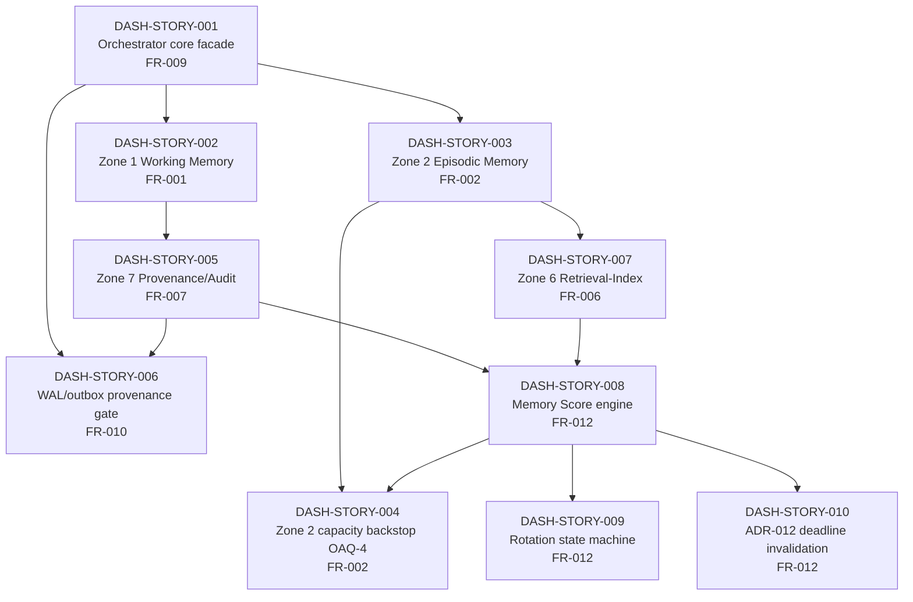

# Sprint 1 Dependency Graph & Definition of Done

**Source of truth:** `docs/phase-6-sprint-planning/backlog_draft.json` (story `depends_on` edges,
acceptance criteria, sub-tasks) and `docs/phase-6-sprint-planning/sp05-sa-review.md` (the SP.0.5
solution-architect review that raised and tracked corrections C-1 through C-4). This file consolidates
both into one reviewable DAG + checklist — it does not replace either source, and if the two ever
disagree, `backlog_draft.json` (the executable backlog) is authoritative for edges/points and
`sp05-sa-review.md` is authoritative for the review history.

## Correction status (per sp05-sa-review.md)

`sp05-sa-review.md` raised four findings against an earlier backlog draft. Checking the *current*
`backlog_draft.json` against each:

| Finding | Severity | Original defect | Current `backlog_draft.json` state |
|---|---|---|---|
| **C-1** | Must fix | AC-006 would index Zone 1, contradicting HLD §3.7 | **Applied** — AC-006's `source` field is explicitly tagged `[CORRECTED per SP.0.5 SA review C-1 — HLD Section 3.7 excludes Zone 1 from the index]` |
| **C-2** | Must fix | DASH-STORY-004 ranked by MemoryScore but did not depend on DASH-STORY-008 (the Memory Score engine) | **Applied** — `depends_on: ["DASH-STORY-003", "DASH-STORY-008"]`, i.e. resolution (a), the preferred option |
| **C-3** | Advisory | DASH-STORY-007's stated rationale claimed Zone 6 depends on Zone 1; HLD §3.7 says Zone 6 indexes Zones 2-5/7/8, not Zone 1 | **Applied** — `depends_on: ["DASH-STORY-003"]` (Zone 2, not Zone 1) and the story's own `invest.independent` field now states the corrected rationale verbatim |
| **C-4** | Must fix | ADR-012 deadline-invalidation wiring (HLD §12C Sprint-1 DoD item) was unowned by any story | **Applied** — `DASH-STORY-010` ("ADR-012 deadline-invalidation wiring on non-Recency term mutation") now exists as its own story |

All four corrections are reflected in the DAG below. `sp05-sa-review.md`'s own text ("Next Review Point:
after scrum-master-agent applies C-1/C-2/C-4, before the SP.0.5 consensus gate closes") frames these as
pending at review time; the backlog content confirms they were subsequently applied, but no separate
SP.0.5 consensus-gate closure artifact was found in `docs/` to independently confirm formal gate
sign-off — that closure record, if one exists, lives outside this documentation set.

## Dependency graph (Sprint 1, corrected edges)

**Critical path:** `S001 → S003 → S007 → S008 → {S004, S009, S010}` — the Memory Score engine
(DASH-STORY-008) is the single highest fan-in dependency in Sprint 1: three stories (004, 009, 010)
cannot start until it lands, and it itself cannot start until both the Retrieval-Index (007, for
TaskRelevance/UserAffinity primitives) and Provenance (005, for ProvenanceConfidence) are available.
Any slip in S001/S003/S005/S007 cascades directly into S008 and everything behind it.

## Definition of Done (per story, consolidated from `backlog_draft.json` sub-tasks + acceptance criteria)

Every Sprint 1 story's sub-tasks already declare a `Dev` / `QA` / `Review` split with story-point
allocations; this table restates that as a pass/fail checklist rather than leaving it only as
point-allocation metadata.

| # | DoD item | Applies to |
|---|---|---|
| 1 | All listed acceptance criteria (`ac_id`s) have a passing test, traced by `ac_id`, not just "tests exist" | All stories |
| 2 | `Dev` sub-task(s) complete and merged | All stories |
| 3 | `QA` sub-task(s) complete, covering the specific scenarios named in the sub-task description (e.g. cross-tenant isolation for DASH-STORY-007, per AC-014) | All stories with a QA sub-task |
| 4 | `Review` sub-task complete where present (security review of tenant isolation controls, HLD I-1/I-2/I-3 — DASH-STORY-007; provenance write-path enforcement review — DASH-STORY-006) | Stories with a Review sub-task |
| 5 | HLD §12C Sprint-1 DoD item — ADR-012 deadline-invalidation wiring — verified against **all three** mutation paths it must cover, per C-4's resolution note | DASH-STORY-010 |
| 6 | No story merges with a `depends_on` edge unresolved (dependency story not yet Done) | All stories, DAG-enforced |
| 7 | Story's `traces_to_fr` still holds after implementation — no undocumented FR drift | All stories |

## Not doing

- Not re-deriving or re-litigating C-1 (AC-006 wording) or C-4 (ADR-012 story ownership) in depth here —
  both are `backlog_draft.json`/SRS-level corrections already applied; this file only cross-references
  their current state for the dependency graph and DoD.
- Not tracking A-1/A-2/A-3 (advisory, non-blocking per `sp05-sa-review.md`) — out of scope for this
  consolidation.
