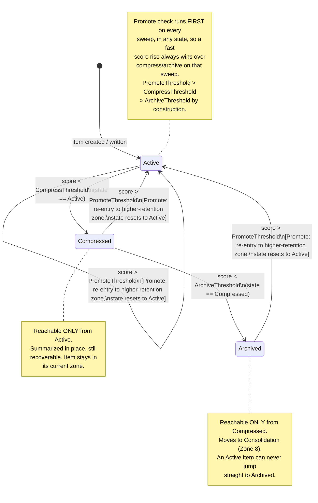

<!-- Generated by Phase 5 pipeline -- do not edit manually -->

```mermaid
stateDiagram-v2
    [*] --> Active : item created / written

    Active --> Compressed : score < CompressThreshold\n(state == Active)
    Compressed --> Archived : score < ArchiveThreshold\n(state == Compressed)

    Active --> Active : score > PromoteThreshold\n[Promote: re-entry to higher-retention zone,\nstate resets to Active]
    Compressed --> Active : score > PromoteThreshold\n[Promote: re-entry to higher-retention zone,\nstate resets to Active]
    Archived --> Active : score > PromoteThreshold\n[Promote: re-entry to higher-retention zone,\nstate resets to Active]

    note right of Compressed
        Reachable ONLY from Active.
        Summarized in place, still
        recoverable. Item stays in
        its current zone.
    end note

    note right of Archived
        Reachable ONLY from Compressed.
        Moves to Consolidation (Zone 8).
        An Active item can never jump
        straight to Archived.
    end note

    note left of Active
        Promote check runs FIRST on every
        sweep, in any state, so a fast
        score rise always wins over
        compress/archive on that sweep.
        PromoteThreshold > CompressThreshold
        > ArchiveThreshold by construction.
    end note
```
